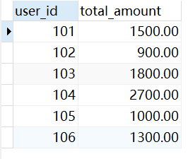
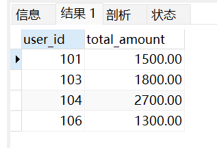
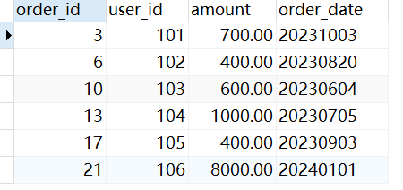
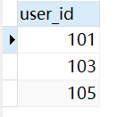

# 订单数据查询

## 问题描述
有一张 `order` 订单表，字段有 `order_id`(订单ID)，`user_id`(用户ID)，`amount`(订单金额)，`order_date` (订单日期为yyyymmdd，如20231001)。

以下是测试数据，用来验证解答是否正确(以MYSQL为例)。

```sql
-- 1. 创建数据库
CREATE DATABASE IF NOT EXISTS sql_practice;

USE sql_practice;


-- 2. 创建 orders 表
DROP TABLE IF EXISTS orders;

CREATE TABLE orders (
    order_id INT PRIMARY KEY,
    user_id INT NOT NULL,
    amount DECIMAL(10, 2) NOT NULL,
    order_date VARCHAR(8) NOT NULL
);


-- 3. 插入示例数据
INSERT INTO orders (order_id, user_id, amount, order_date) VALUES

-- 用户 101：2023 年总消费 1500，并且 10月1、2、3日连续下单
(1, 101, 300.00, '20231001'),
(2, 101, 500.00, '20231002'),
(3, 101, 700.00, '20231003'),

-- 用户 102：2023 年总消费 900，不超过 1000
(4, 102, 200.00, '20230310'),
(5, 102, 300.00, '20230515'),
(6, 102, 400.00, '20230820'),

-- 用户 103：2023 年总消费 1800
-- 6月1、2、3、4连续下单
(7, 103, 300.00, '20230601'),
(8, 103, 400.00, '20230602'),
(9, 103, 500.00, '20230603'),
(10, 103, 600.00, '20230604'),

-- 用户 104：日期不连续
(11, 104, 800.00, '20230701'),
(12, 104, 900.00, '20230703'),
(13, 104, 1000.00, '20230705'),

-- 用户 105：同一天有两笔订单，用来测试 DISTINCT 日期
(14, 105, 100.00, '20230901'),
(15, 105, 200.00, '20230901'),
(16, 105, 300.00, '20230902'),
(17, 105, 400.00, '20230903'),

-- 用户 106：包含 2022、2023、2024 年订单
-- 用来测试年份筛选是否正确
(18, 106, 5000.00, '20221231'),
(19, 106, 600.00, '20230115'),
(20, 106, 700.00, '20230215'),
(21, 106, 8000.00, '20240101');
```

## 问题1
查询2023年每个用户的订单总金额。

```sql
SELECT
    user_id,
    SUM(amount) AS total_amount
FROM orders
WHERE order_date >= '20230101'
  AND order_date <  '20240101'
GROUP BY user_id;
```

运行结果
<div align="center">
  
</div>


## 问题2
查询 2023 年消费金额超过 1000 元的用户 ID 及其总金额
```sql
SELECT
    user_id,
    SUM(amount) AS total_amount
FROM orders
WHERE order_date >= '20230101'
  AND order_date <  '20240101'
GROUP BY user_id
HAVING SUM(amount) > 1000;
```

运行结果
<div align="center">
  
</div>


## 问题3
查询每个用户金额最大的那笔订单的所有信息
```sql
SELECT
    order_id,
    user_id,
    amount,
    order_date
FROM (
    SELECT
        *,
        ROW_NUMBER() OVER (
            PARTITION BY user_id
            ORDER BY amount DESC
        ) AS rn
    FROM orders
) t
WHERE rn = 1;
```

运行结果
<div align="center">
  
</div>

## 问题4
查询连续 3 天都有下单的用户
```sql
WITH user_dates AS (
    SELECT DISTINCT
        user_id,
        STR_TO_DATE(order_date, '%Y%m%d') AS dt
    FROM orders
),
t AS (
    SELECT
        user_id,
        dt,
        LAG(dt, 1) OVER (
            PARTITION BY user_id
            ORDER BY dt
        ) AS prev1,
        LAG(dt, 2) OVER (
            PARTITION BY user_id
            ORDER BY dt
        ) AS prev2
    FROM user_dates
)
SELECT DISTINCT user_id
FROM t
WHERE DATEDIFF(dt, prev1) = 1
  AND DATEDIFF(dt, prev2) = 2;
```
运行结果
<div align="center">
  
</div>