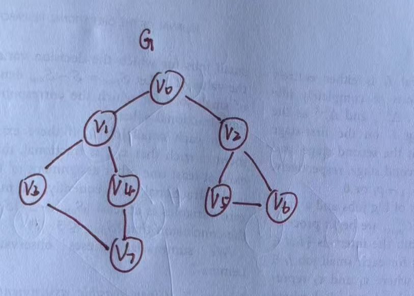

# 深度优先搜索（DFS）

给定一张图$G=(V,E)$，现在我要遍历图$G$上的每个顶点，常见的遍历方法有<mark>深度</mark>优先搜索和<mark>广度</mark>优先搜索。他们对无向图和有向图都适用。
这里我先整理一下深度优先搜索（Depth First Search, DFS）。

## 1. DFS 的基本思路

假设初始时图中所有顶点均未被访问，深度优先遍历依次执行以下步骤：

1. 任选一个未被访问的顶点 $v$，访问该顶点并将其标记为已访问；
2. 从 $v$ 的邻接顶点中选择一个**未被访问**的顶点，并从该顶点出发继续进行**深度优先遍历**；
3. 当当前顶点不存在未被访问的邻接顶点时，回溯到上一个顶点，继续访问其他未被访问的邻接顶点；
4. 重复上述过程，直到从 $v$ 可达的所有顶点都被访问；
5. 如果图中仍有顶点未被访问，则另选一个未被访问的顶点作为起点；
6. 重复上述过程，直到图中所有顶点都被访问。

显然，这是一个递归的过程。为了在遍历过程中便于区分顶点是否已被访问，需附设访问标志数组`visited `。


## 2.示例

<div align="center">
  
  <p>图 1 无向图G</p>
</div>


<div align="center">
  
  <p>图 2 深度优先搜索的过程</p> 
  <small>注：粗实线箭头表示访问路径，虚线箭头表示回溯路径。</small>
</div>

以无向图$G$为例，深度优先搜索遍历图的过程如图2所示。假设从顶点$v_0$出发进行搜索，在访问了顶点$v_0$之后，选择邻接点$v_1$。因为$v_1$未曾被访问，则从$v_1$出发进行搜索。依次类推，接着从$v_3,v_7,v_4$出发进行搜索。在访问了$v_4$之后，由于$v_4$的邻接点已经都被访问，则搜索回到$v_7$。由于同样的理由，搜索继续回到$v_3,v_1$直至$v_0$，此时由于$v_0$的另一个邻接点未被访问，则搜索又从$v_0$到$v_2$，再继续进行下去。由此，得到的顶点访问序列为：

$$v_0,v_1,v_3,v_7,v_4,v_2,v_5,v_6$$


## 3. 使用邻接表表示图

邻接表使用一个字典记录每个顶点的所有邻接顶点。例如，下面是一个无向图：

```python
graph = {
        0: [1, 2],
        1: [0, 3, 4],
        2: [0, 5, 6],
        3: [1, 7],
        4: [1, 7],
        5: [2, 6],
        6: [2, 5],
        7: [3, 4]
    }
```

其中，`graph[0] = [1, 2]` 表示顶点 `0` 与顶点 `1`、`2` 相邻。

对于无向图，边需要记录两次。例如，存在边 `(0, 1)` 时，既要把 `1` 放入 `graph[0]`，也要把 `0` 放入 `graph[1]`。

## 4. 递归实现 DFS

递归写法最能直接体现 DFS 的“深入”和“回溯”过程。

```python
from typing import Dict, List, Set

Graph = Dict[int, List[int]]

def dfs(
    graph: Graph,
    visited: Set[int],
    result: List[int],
    vet: int
) -> None:
    """从顶点 vet 开始进行深度优先遍历。"""
    result.append(vet)      # 记录当前顶点
    visited.add(vet)        # 标记当前顶点已经访问

    for adj_vet in graph.get(vet, []):
        if adj_vet in visited:
            continue        # 跳过已经访问的顶点
        dfs(graph, visited, result, adj_vet)


def graph_dfs(graph: Graph, start_vet: int) -> List[int]:
    """返回从 start_vet 出发的 DFS 遍历序列。"""
    if start_vet not in graph:
        raise ValueError("起始顶点不在图中")

    result = []         # 保存遍历结果
    visited = set()     # 保存已经访问的顶点
    dfs(graph, visited, result, start_vet)
    return result


if __name__ == "__main__":
    graph = {
        0: [1, 2],
        1: [0, 3, 4],
        2: [0, 5, 6],
        3: [1, 7],
        4: [1, 7],
        5: [2, 6],
        6: [2, 5],
        7: [3, 4]
    }

    order = graph_dfs(graph, 0)
    print("DFS 遍历序列：", order)
```

运行结果为：

```text
DFS 遍历序列： [0, 1, 3, 7, 4, 2, 5, 6]
```


## 5. 非递归实现 DFS

递归过程本质上使用了系统的调用栈。因此，也可以显式使用栈实现 DFS：

```python
def graph_dfs_iterative(graph: Graph, start_vet: int) -> List[int]:
    """使用栈实现深度优先遍历。"""
    if start_vet not in graph:
        raise ValueError("起始顶点不在图中")

    result = []
    visited = set()
    stack = [start_vet]

    while stack:
        vet = stack.pop()

        if vet in visited:
            continue

        visited.add(vet)
        result.append(vet)

        # 栈是后进先出结构。逆序压栈可以使遍历顺序
        # 与前面的递归实现保持一致。
        for adj_vet in reversed(graph.get(vet, [])):
            if adj_vet not in visited:
                stack.append(adj_vet)

    return result
```

当图很深时，递归实现可能超过 Python 的最大递归深度，此时更适合使用显式栈。

## 6. 遍历非连通图

从一个起点执行 DFS，只能访问该起点能够到达的顶点。如果图由多个互不连通的部分组成，需要依次检查所有顶点：

```python
def find_connected_components(graph: Graph) -> List[List[int]]:
    """返回无向图中的所有连通分量。"""
    visited = set()
    components = []

    for vet in graph:
        if vet in visited:
            continue

        component = []
        dfs(graph, visited, component, vet)
        components.append(component)

    return components
```

每次从一个未访问顶点开始 DFS，得到的顶点集合就是一个连通分量。

## 7. 复杂度分析

设图的顶点数为 $|V|$，边数为 $|E|$，并使用邻接表存储图。

| 复杂度 | 结果 | 原因 |
| --- | --- | --- |
| 时间复杂度 | $O(\lvert V\rvert+\lvert E\rvert)$ | 每个顶点至多访问一次，每条边至多检查常数次 |
| 空间复杂度 | $O(\lvert V\rvert)$ | `visited`、遍历结果和递归栈最多保存 $\lvert V\rvert$ 个顶点 |

在无向图中，每条边会分别出现在两个端点的邻接表中，因此会被检查两次，但常数 `2` 不影响渐进复杂度，仍记为 $O(|V|+|E|)$。

## 8. 常见问题

### 8.1 为什么要在递归前标记顶点？

顶点一旦被访问，就应立即加入 `visited`。如果等递归结束后再标记，程序在有环图中可能反复进入同一个顶点。

### 8.2 为什么 DFS 没有遍历所有顶点？

单次 DFS 只能遍历起点所在的连通部分。要遍历整个非连通图，需要像 `find_connected_components()` 一样，对每个未访问顶点重新启动 DFS。

### 8.3 为什么我的遍历顺序与示例不同？

DFS 的遍历顺序取决于邻接表中顶点的排列顺序。顺序不同不代表算法错误，只要每个可达顶点都被访问一次，并且符合深度优先的搜索过程即可。

### 8.4 `set[Vertex]()` 可以直接使用吗？

`set[Vertex]` 属于较新的类型注解写法。为了兼容 Python 3.7，可以使用：

```python
from typing import Set

visited: Set[int] = set()    # 创建空集合并添加类型注解
```

## 9. DFS 的典型应用

DFS 不只是遍历图的工具，还常用于：

- 判断两个顶点是否可达；
- 寻找无向图的连通分量；
- 检测图中是否存在环；
- 对有向无环图进行拓扑排序；
- 寻找有向图的强连通分量；
- 求解迷宫、路径搜索和其他回溯问题。


