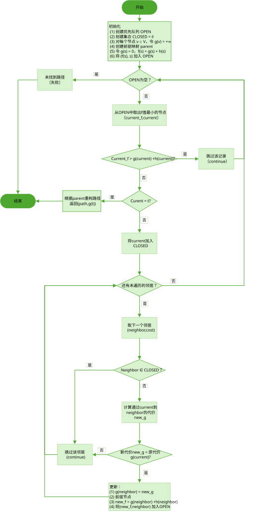
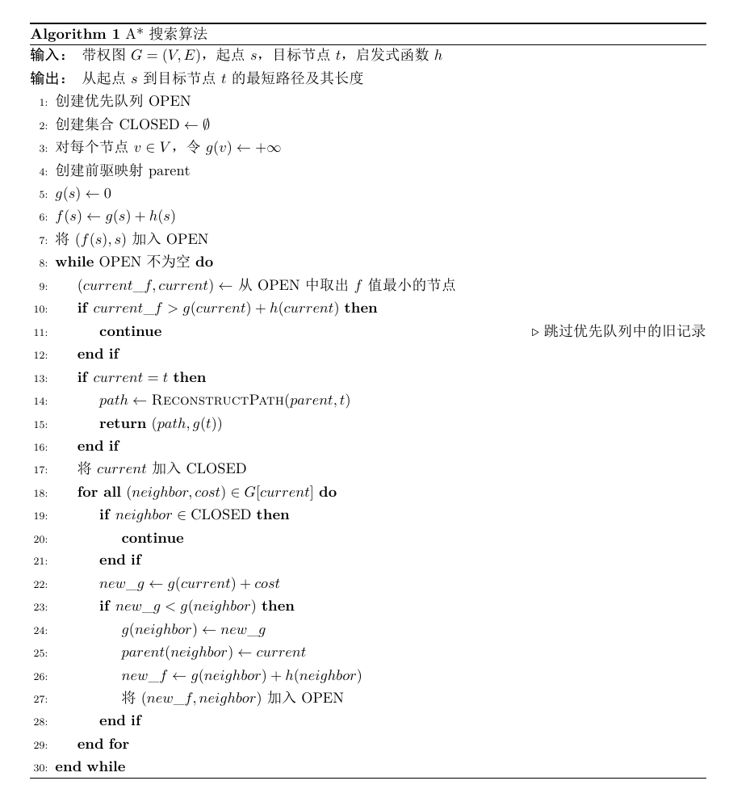
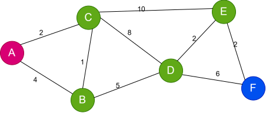
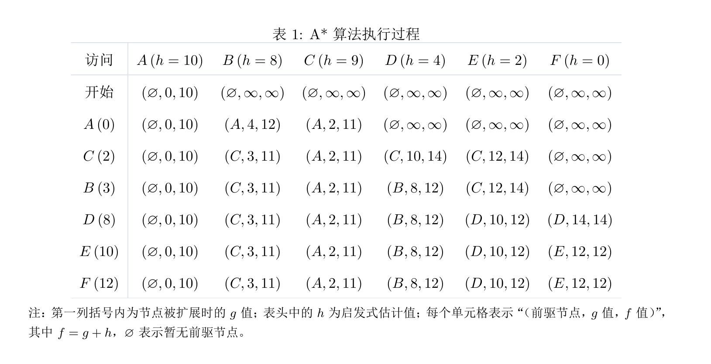

# A* 搜索算法


## A* 算法原理

A*（A-Star）算法是一种启发式搜索算法，通常用于在带权图中寻找从指定起点到目标节点的最短路径。
与 Dijkstra 算法只考虑从起点到当前节点的实际路径代价不同，A* 算法还引入了当前节点到目标节点的估计代价，从而使搜索过程更有方向性。

A* 算法的核心是评价函数：

$$
f(n)=g(n)+h(n),
$$

其中：

- $g(n)$：从起点 $s$ 到当前节点 $n$ 的当前已知最小路径代价；
- $h(n)$：从当前节点 $n$ 到目标节点 $t$ 的估计代价，也称为启发式函数；
- $f(n)$：经过当前节点 $n$ 到达目标节点的估计总代价。

因此，A* 算法在搜索过程中，每次从候选节点中选择 $f(n)$ 最小的节点进行扩展。

可以简单理解为：

$$
\boxed{\text{A*：已经付出的代价 }g(n)+\text{ 预计还需要的代价 }h(n)}
$$

其中，$g(n)$ 描述“已经走了多远”，而 $h(n)$ 描述“预计距离目标还有多远”。

---

### 启发式函数

启发式函数 $h(n)$ 是 A* 算法区别于 Dijkstra 算法的关键。

设 $h^*(n)$ 表示从节点 $n$ 到目标节点的真实最短距离。如果对于任意节点 $n$ 都满足

$$
0\leq h(n)\leq h^*(n),
$$

则称 $h(n)$ 为**可采纳的（Admissible）启发式函数**。

也就是说，启发式函数可以低估节点到目标的实际距离，但不能高估。

例如，在地图路径规划问题中，可以使用当前节点到目标节点的直线距离作为启发式函数：

$$
h(n)=\text{节点 }n\text{ 到目标节点的直线距离}.
$$

启发式函数越接近真实的剩余距离，通常越能够减少不必要的节点扩展。

特别地，当

$$
h(n)=0
$$

对所有节点都成立时，有

$$
f(n)=g(n),
$$

此时 A* 算法的节点选择规则就与 Dijkstra 算法相同。

---

### OPEN 与 CLOSED

A* 算法通常使用两个重要的数据结构：`OPEN` 和 `CLOSED`。

| 数据结构 | 作用 |
| --- | --- |
| `OPEN` | 保存已经发现但尚未扩展的候选节点，并优先选择 $f$ 值最小的节点 |
| `CLOSED` | 保存已经扩展过的节点 |
| $g(n)$ | 保存从起点到节点 $n$ 的当前已知最小路径代价 |
| `parent(n)` | 保存节点 $n$ 当前最优路径上的前驱节点，用于恢复最终路径 |

算法开始时，将起点加入 `OPEN`。

之后不断从 `OPEN` 中取出 $f$ 值最小的节点进行扩展，并将其加入 `CLOSED`。对于当前节点的每个相邻节点，计算经过当前节点到达该邻居的新路径代价：

$$
new\_g=g(current)+cost(current,neighbor).
$$

如果

$$
new\_g<g(neighbor),
$$

说明找到了一条到达 `neighbor` 的更短路径，因此更新：

$$
g(neighbor)=new\_g,
$$

同时修改其前驱节点：

$$
parent(neighbor)=current.
$$

然后重新计算：

$$
f(neighbor)=g(neighbor)+h(neighbor),
$$

并将新的记录加入 `OPEN`。

当从 `OPEN` 中取出的节点为目标节点时，可以通过 `parent` 从目标节点反向回溯，得到最终路径。

## 算法流程图
<div align="center">
  
</div>

## 伪代码
<div align="center">
  
</div>


## 示例
输入图如下，其中A为起点，F为目标节点。
设需要寻找从节点 $A$ 到节点 $F$ 的最短路径。


<div align="center">
  
</div>
各节点的启发式函数值为：

$$
h(A)=10,\quad
h(B)=8,\quad
h(C)=9,\quad
h(D)=4,\quad
h(E)=2,\quad
h(F)=0.
$$
在下面的计算过程中，每个单元格使用

$$
(parent,g,f)
$$

表示节点当前的状态，其中：

- `parent`：当前前驱节点；
- $g$：从起点 $A$ 到当前节点的当前已知最小路径代价；
- $f=g+h$：A* 的评价函数值。


### 手算过程

初始状态下只有起点 $A$：

$$
g(A)=0,
$$

因此：

$$
f(A)=g(A)+h(A)=0+10=10.
$$

首先扩展节点 $A$。

通过 $A$ 可以到达 $B$ 和 $C$：

$$
g(B)=4,\qquad f(B)=4+8=12,
$$

$$
g(C)=2,\qquad f(C)=2+9=11.
$$

由于

$$
f(C)=11<f(B)=12,
$$

所以下一步选择节点 $C$。

扩展 $C$ 后，通过 $C$ 到达 $B$ 的新路径代价为：

$$
new\_g=g(C)+cost(C,B)=2+1=3.
$$

由于

$$
3<g(B)=4,
$$

因此更新：

$$
g(B)=3,
$$

并令：

$$
parent(B)=C.
$$

此时：

$$
f(B)=3+8=11.
$$

按照相同的方法继续搜索，节点的扩展顺序为：

$$
\boxed{A\rightarrow C\rightarrow B\rightarrow D\rightarrow E\rightarrow F}.
$$

需要注意的是，**节点扩展顺序并不一定等于最终得到的最短路径**。本例中二者恰好相同。

完整的计算过程如下表所示：
<div align="center">
  
</div>

---

### 路径恢复

当 A* 搜索到目标节点 $F$ 后，根据 `parent` 从目标节点反向寻找前驱：

$$
F\leftarrow E\leftarrow D\leftarrow B\leftarrow C\leftarrow A.
$$

反转后得到最终路径：

$$
\boxed{A\rightarrow C\rightarrow B\rightarrow D\rightarrow E\rightarrow F}.
$$

对应的路径长度为：

$$
2+1+5+2+2=12.
$$

因此，从 $A$ 到 $F$ 的最短路径长度为：

$$
\boxed{12}.
$$


## Python实现
```python
import heapq


def reconstruct_path(parent, goal):
    """根据 parent 映射，从目标节点反向恢复路径。"""
    path = [goal]

    while goal in parent:
        goal = parent[goal]
        path.append(goal)

    path.reverse()
    return path


def a_star(graph, start, goal, h):
    # 1. 创建 OPEN、CLOSED、g、parent
    open_heap = []
    closed = set()

    g = {node: float("inf") for node in graph}
    parent = {}

    # 2. 初始化起点
    g[start] = 0
    f_start = g[start] + h[start]
    heapq.heappush(open_heap, (f_start, start))

    # 3. A* 主循环
    while open_heap:
        # 从 OPEN 中取出 f 值最小的节点
        current_f, current = heapq.heappop(open_heap)

        # 跳过优先队列中的旧记录
        if current_f > g[current] + h[current]:
            continue

        # 到达目标节点
        if current == goal:
            path = reconstruct_path(parent, goal)
            return path, g[goal]

        # 将 current 加入 CLOSED
        closed.add(current)

        # 遍历 current 的所有邻居
        for neighbor, cost in graph[current]:

            # 已经处理过的节点直接跳过
            if neighbor in closed:
                continue

            # 计算经过 current 到达 neighbor 的新路径长度
            new_g = g[current] + cost

            # 如果找到更短路径
            if new_g < g[neighbor]:
                g[neighbor] = new_g
                parent[neighbor] = current

                new_f = g[neighbor] + h[neighbor]

                # 将新记录加入 OPEN
                heapq.heappush(open_heap, (new_f, neighbor))

    # OPEN 为空仍未到达目标节点
    return None, float("inf")


# =========================
# 测试
# =========================

graph = {
    "A": [("B", 4), ("C", 2)],
    "B": [("A", 4), ("C", 1), ("D", 5)],
    "C": [("A", 2), ("B", 1), ("D", 8), ("E", 10)],
    "D": [("B", 5), ("C", 8), ("E", 2), ("F", 6)],
    "E": [("C", 10), ("D", 2), ("F", 2)],
    "F": [("D", 6), ("E", 2)]
}

# 启发式函数 h(n)
h = {
    "A": 10,
    "B": 8,
    "C": 9,
    "D": 4,
    "E": 2,
    "F": 0
}

start = "A"
goal = "F"

path, distance = a_star(graph, start, goal, h)

print("最短路径：", " -> ".join(path))
print("最短距离：", distance)

```

输出
```text
最短路径： A -> C -> B -> D -> E -> F
最短距离： 12
```

## Python 实现中的关键问题

### 为什么优先队列中会出现旧记录？

Python 的 `heapq` 可以方便地取出当前优先级最小的元素，但不能直接修改已经存在于堆中的元素。

假设节点 $B$ 原来的状态为：

$$
g(B)=4,\qquad h(B)=8,
$$

因此：

$$
f(B)=4+8=12.
$$

此时优先队列中存在：

```python
(12, "B")
```

后来搜索过程中发现了一条到达 $B$ 的更短路径：

$$
g(B)=3,
$$

于是：

$$
f(B)=3+8=11.
$$

程序会直接向优先队列中加入新的记录：

```python
(11, "B")
```

此时优先队列中可能同时存在：

```text
(11, B)
(12, B)
```

其中 `(12, B)` 就是一条旧记录。

因此，当记录从优先队列中取出时，需要进行判断：

```python
if current_f > g[current] + h[current]:
    continue
```

如果当前取出的 `current_f` 大于该节点最新的

$$
g(current)+h(current),
$$

说明这是一条已经过期的记录，直接跳过即可。


## A* 与 Dijkstra 算法的关系

A* 与 Dijkstra 算法的核心区别在于选择下一个扩展节点时所依据的评价标准不同。

| 算法 | 节点选择依据 | 是否使用启发信息 | 特点 |
| --- | --- | --- | --- |
| Dijkstra | $g(n)$ | 否 | 根据起点到当前节点的实际路径代价进行搜索 |
| A* | $f(n)=g(n)+h(n)$ | 是 | 同时考虑已经产生的路径代价和到目标节点的估计代价 |

Dijkstra 算法只考虑：

$$
g(n),
$$

而 A* 算法考虑：

$$
g(n)+h(n).
$$

因此，A* 不仅关注“从起点到这里已经走了多远”，还考虑“从这里到目标预计还要走多远”。

特别地，如果令所有节点的启发式函数均为：

$$
h(n)=0,
$$

那么：

$$
f(n)=g(n)+0=g(n).
$$

此时 A* 每次选择 $f$ 最小的节点，就等价于选择 $g$ 最小的节点，因此其搜索规则退化为 Dijkstra 算法。

> 因此，可以将 Dijkstra 算法看作启发式函数恒为 $0$ 时 A* 算法的一种特殊情况。


## 补充：启发式函数的一致性

在使用 `CLOSED` 集合，并且已经进入 `CLOSED` 的节点不再重新打开的 A* 实现中，通常要求启发式函数满足**一致性（Consistency）**。

对于任意一条从节点 $n$ 到节点 $n'$、代价为 $c(n,n')$ 的边，需要满足：

$$
h(n)\leq c(n,n')+h(n').
$$

同时目标节点满足：

$$
h(t)=0.
$$

一致性可以理解为启发式估计满足一种类似“三角不等式”的性质。

在一致启发式函数下，当一个节点以最小 $f$ 值从 `OPEN` 中取出并进入 `CLOSED` 后，其当前的最优路径代价不需要再次修改，因此可以安全地不重新打开该节点。

对于一般图搜索，需要注意：

> **可采纳性主要保证启发式函数不会高估真实剩余代价，而一致性进一步保证沿路径的 $f$ 值具有良好的单调性质。**

因此，如果采用本文这种“节点进入 `CLOSED` 后不再重新打开”的实现，使用一致的启发式函数更加稳妥。


## 参考文献

[1] Learn Graph Theory. A* 搜索算法：游戏和 AI 中的寻路[EB/OL]. 2026-06.  
<https://learngraphtheory.org/articles/zh/a-star-search-algorithm.html>

[2] 小黎的Ally. 路径规划与轨迹跟踪系列算法学习：第4讲 A*算法[EB/OL]. 2021-01-10.  
<https://www.bilibili.com/video/BV1Jt4y1z7Ry/>