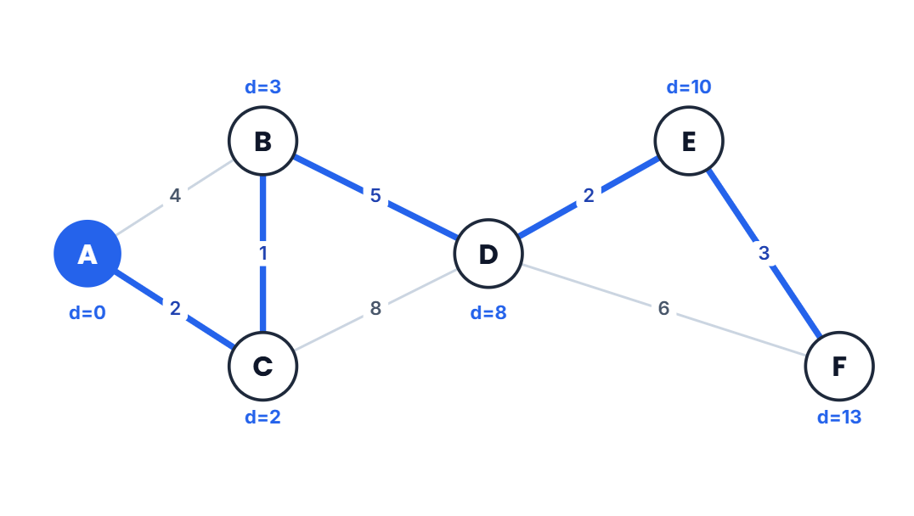
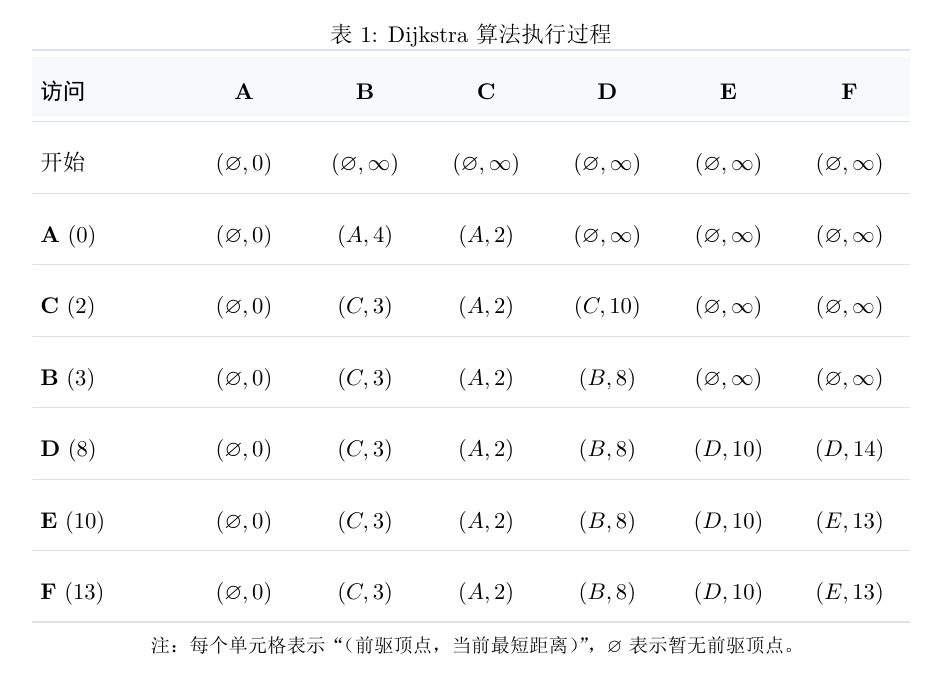
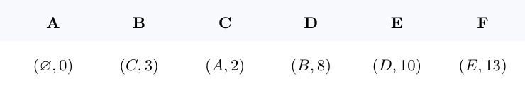

# Dijkstra 算法：从贪心思想到最短路径还原

Dijkstra 算法用于求解**非负权图中的单源最短路径问题**：给定一个起点，计算它到其余各节点的最短距离。

算法不仅能回答“最短距离是多少”，还可以通过记录每个节点的前驱，进一步回答“最短路径具体经过哪些节点”。

> **使用前提：图中所有边的权重都必须大于或等于 0。**

## 1. 问题定义

在带权图中：

- 节点可以表示城市、路口或网络设备；
- 边表示两个节点之间可以直接到达；
- 边权表示距离、时间或费用；
- 一条路径的长度等于路径上所有边权之和。

设起点为 `s`，用 `δ(s, v)` 表示从 `s` 到节点 `v` 的真实最短距离。
如果某个节点无法从起点到达，那么它的最短距离记为 `∞`。

## 2. Dijkstra 算法维护了什么？

算法运行时主要维护以下四类信息：

| 名称          | 含义                                        |
| ------------- | ------------------------------------------- |
| `distance[v]` | 当前已经发现的、从起点到 `v` 的最短路径长度 |
| `visited`     | 最短距离已经确定的节点集合                  |
| `previous[v]` | 当前最短路径中，`v` 的前一个节点            |
| 最小堆        | 快速取出暂定距离最小的未访问节点            |

初始时，起点到自身的距离为 `0`，其余节点的距离均为 `∞`：

```text
distance[start] = 0
distance[其他节点] = ∞
```

这里需要特别注意：`distance[v]` 是**目前已经找到的最好结果**，不一定一开始就是真实最短距离。

因为 `distance[v]` 来自某条实际找到的路径，所以它不会小于真实最短距离，即：

```text
δ(s, v) ≤ distance[v]
```

算法的任务，就是不断降低这些暂定距离，直到它们等于真实最短距离。

## 3. 核心操作：选择与松弛

Dijkstra 算法不断重复下面两个操作。

### 3.1 选择距离最小的未访问节点

从所有<mark>未访问</mark>节点中，选择 `distance` 最小的节点 `u`，并将它加入 `visited`。

这一刻，`distance[u]` 就不再是暂定值，而是从起点到 `u` 的真实最短距离。为什么可以这样确定，将在第 5 节中证明。

### 3.2 松弛相邻节点

在 `u` 的相邻节点中考虑未访问节点`v`，设节点 `u` 与节点 `v` 之间的边权为 `w(u, v)`。经过 `u` 到达 `v` 的距离为：

```text
new_distance = distance[u] + w(u, v)
```

如果这条新路线比原来记录的路线更短，就更新 `v`：

```text
如果 new_distance < distance[v]：
    distance[v] = new_distance
    previous[v] = u
```

这个降低暂定距离的过程称为**松弛（relaxation）**。

## 4. 示例：从 A 出发寻找最短路径

下面是一张无向带权图。蓝色边组成从 `A` 出发的一棵最短路径树。

<div align="center">
  
  <p></p>
</div>

  

按Dijsktra思想，找到顶点 `A` 到其余所有顶点的最短路及最短路径，手算过程如下：

<div align="center">
  
  <p></p>
</div>

最终结果
<div align="center">
  
  <p></p>
</div>

根据上表结果，可知 `A` 点到任意点的最短距离及对应的最短路径。


## 5. 为什么选出的节点可以立即确定最短距离？

这是理解 Dijkstra 算法最关键的地方。

### 5.1 证明

用 $S$ 表示最短距离已经确定的节点集合。采用数学归纳法证明：每次加入 $S$ 的节点，其 $distance$ 都等于真实最短距离。

**基础情况**

起点 $s$ 第一个被选择，并且：

$$
distance[s] = 0 = δ(s, s)
$$

所以结论对起点成立。

**归纳假设**

假设集合 $S$ 中所有节点的最短距离都已经正确。

**归纳步骤**

设 $u$ 是当前未访问节点中 $distance$ 最小的节点。假设 $distance[u]$ 不是最短距离($\neq \delta(s,u)$)，即存在一条从 $s$ 到 $u$ 的更短路径 $P$。令路径$P$的总长度为$L$，则

$$
L < distance[u].
$$

沿着路径 $P$ 从 $s$ 向 $u$ 行走，设 $y$ 是遇到的第一个不属于 $S$ 的节点，$x$ 是 $y$ 在路径$P$上的前驱节点。因此：

$$
x \in S, \quad y \notin S.
$$

令 $L_y$ 表示路径 $P$ 从 $s$ 到 $y$ 的前缀长度。

根据归纳假设，节点$x$的最短距离已经正确。当 $x$ 被访问时，算法会对边 $(x, y)$ 进行松弛，因此：

$$
\begin{aligned}
{distance}[y] & \le {distance}[x] + w(x, y) \\
                   & = \delta(s,x) + w(x,y) \\
                   & \leq L_y.
\end{aligned}
$$

其中， $\delta(s,x)$ 是从 $s$ 到 $x$ 的真正最短距离，它不会大于路径 $P$ 从 $s$ 到 $x$ 的前缀长度。

由于所有边权非负，路径走到 $y$ 时的长度不会超过走完整条路径 $P$ 的长度，所以：

$$
L_y \leq L.
$$

于是：
$$
distance[y] \leq L_y \leq L< distance[u].
$$

即：
$$
distance[y] < distance[u].
$$
但 $y$ 尚未访问，这与 $u$ 是暂定距离最小的未访问节点矛盾。

因此假设不成立，必有：

$$
distance[u] = \delta(s, u)
$$

归纳完成。

> 如果假设中的更短路径只经过已经访问的中间节点，那么上面的 $y$ 就是 $u$ 本身。$u$ 的前驱被访问时已经松弛过 $u$，因此这条更短路径同样不可能被漏掉。

### 5.2 非负边权在证明中起什么作用？

证明使用了下面这一步：

```text
到达中途节点 y 的路径长度 ≤ 到达终点 u 的路径总长度
```

只有后续边权均非负时，这个不等式才一定成立。

如果允许负权边，路径可能先以较大代价到达某个未访问节点，再通过负权边把总代价大幅降低。例如：

```text
s → u 的权重为 2
s → x 的权重为 5
x → u 的权重为 -10
```

Dijkstra 会先确定距离为 `2` 的 `u`，但真实最短路径 `s → x → u` 的长度是 `-5`。因此，只要图中存在负权边，就不能直接使用 Dijkstra 算法。

## 6. 如何根据前驱顶点还原最短路径？

`distance` 只能告诉我们最短距离，无法单独说明最短路线经过哪些节点。要还原路径，需要增加一个前驱表 `previous`。

每当边 `(u,v)` 对节点 `v` 松弛成功时，同时执行：

```text
previous[v] = u
```

它表示：当前找到的、从起点到 `v` 的最短路线，最后一条边是 `u → v`。


如果要寻找从 `A` 到 `F` 的最短路径，就从 `F` 开始不断寻找前驱：

```text
F ← E ← D ← B ← C ← A
```

将顺序反转后得到：

```text
A → C → B → D → E → F
```

路径长度为：

```text
2 + 1 + 5 + 2 + 3 = 13
```


## 7. Python 完整实现

下面的代码同时返回最短距离表和前驱表，并提供路径还原函数。

```python
import heapq
from math import inf
from typing import Dict, List, Optional, Set, Tuple


Graph = Dict[str, List[Tuple[str, float]]]


def dijkstra(
    graph: Graph,
    start: str
) -> Tuple[Dict[str, float], Dict[str, Optional[str]]]:
    """计算 start 到其余节点的最短距离，并记录每个节点的前驱。"""
    if start not in graph:
        raise ValueError("起点不在图中")

    # Dijkstra 要求所有边权非负，并要求邻接节点也出现在图中。
    for node, edges in graph.items():
        for neighbor, weight in edges:
            if neighbor not in graph:
                raise ValueError(f"节点 {neighbor} 缺少邻接表")
            if weight < 0:
                raise ValueError("Dijkstra 算法不能处理负权边")

    distance = {node: inf for node in graph}
    previous: Dict[str, Optional[str]] = {
        node: None for node in graph
    }
    visited: Set[str] = set()

    distance[start] = 0
    min_heap = [(0, start)]  # (暂定距离, 节点)

    while min_heap:
        current_distance, current = heapq.heappop(min_heap)

        # 同一节点可能以不同距离多次进入堆。
        # 第一次被取出后，它的最短距离已经确定。
        if current in visited:
            continue

        visited.add(current)

        for neighbor, weight in graph[current]:
            if neighbor in visited:
                continue

            new_distance = current_distance + weight

            # 松弛：发现了到达 neighbor 的更短路线。
            if new_distance < distance[neighbor]:
                distance[neighbor] = new_distance
                previous[neighbor] = current
                heapq.heappush(
                    min_heap,
                    (new_distance, neighbor)
                )

    return distance, previous


def reconstruct_path(
    previous: Dict[str, Optional[str]],
    start: str,
    target: str
) -> List[str]:
    """根据前驱表还原 start 到 target 的最短路径。"""
    if start not in previous or target not in previous:
        raise ValueError("起点或终点不在图中")

    path = []
    current: Optional[str] = target

    while current is not None:
        path.append(current)

        if current == start:
            path.reverse()
            return path

        current = previous[current]

    # 前驱链没有回到 start，说明 target 不可达。
    return []


if __name__ == "__main__":
    # 无向图中的每条边需要在邻接表中记录两次。
    graph = {
        "A": [("B", 4), ("C", 2)],
        "B": [("A", 4), ("C", 1), ("D", 5)],
        "C": [("A", 2), ("B", 1), ("D", 8)],
        "D": [("B", 5), ("C", 8), ("E", 2), ("F", 6)],
        "E": [("D", 2), ("F", 3)],
        "F": [("D", 6), ("E", 3)],
    }

    distance, previous = dijkstra(graph, "A")

    for target in graph:
        path = reconstruct_path(previous, "A", target)
        path_text = " -> ".join(path) if path else "不可达"
        print(
            f"{target}: distance={distance[target]}, "
            f"path={path_text}"
        )
```

运行结果如下：

```text
A: distance=0, path=A
B: distance=3, path=A -> C -> B
C: distance=2, path=A -> C
D: distance=8, path=A -> C -> B -> D
E: distance=10, path=A -> C -> B -> D -> E
F: distance=13, path=A -> C -> B -> D -> E -> F
```

代码没有直接修改堆中已有的旧条目，而是把新距离再次压入堆中。因此，同一个节点可能在堆中出现多次。节点第一次以最小距离被取出后会被加入 `visited`，以后取出的旧条目会被直接跳过，这种写法常被称为**惰性删除**。

如果只需要起点到某一个终点的最短路径，可以在终点从堆中取出并加入 `visited` 时提前结束。不能在终点第一次被发现或第一次被压入堆时结束，因为它的暂定距离之后仍可能继续降低。

## 8. 时间复杂度与空间复杂度

设节点数为 `V`，边数为 `E`。

使用邻接表和二叉最小堆时：

- 每条边至多引起一次成功松弛和一次入堆；
- 每次入堆、出堆的时间为 `O(log V)`；
- 总时间复杂度为 `O((V + E) log V)`，通常也写作 `O(E log V)`；
- 邻接表占用 `O(V + E)` 空间；
- `distance`、`previous` 和 `visited` 共占用 `O(V)` 额外空间；
- 采用惰性删除时，堆中可能保留旧条目，最坏可占用 `O(E)` 空间，因此额外空间为 `O(V + E)`。

如果使用简单数组，每轮用线性扫描寻找距离最小的未访问节点，时间复杂度为 `O(V²)`，更适合边非常多的稠密图或教学实现。

## 9. 常见问题

### 9.1 节点进入堆，就表示最短距离确定了吗？

不是。进入堆只表示找到了一条到达该节点的路线。节点以当前最小距离从堆中取出，并第一次加入 `visited` 时，它的最短距离才被确定。

### 9.2 更短路径能否经过已经访问的节点到达当前节点？

如果这条路径的最后一个中间节点已经访问，那么该节点被处理时就已经松弛过通往当前节点的边，这条路径不会等到以后才被发现。

### 9.3 为什么不能处理负权边？

负权边可能让一条前半段较长的路线在后半段突然变短，从而破坏“当前最小节点不会再被改进”的保证。含负权边时可以考虑 Bellman-Ford 算法。

### 9.4 图不连通怎么办？

算法只会处理从起点可以到达的节点。不可达节点的距离保持为 `∞`，路径还原函数返回空列表。

### 9.5 Dijkstra 能处理有向图吗？

可以。算法同时适用于有向图和无向图，只要边权非负。区别只在邻接表：无向边需要记录两个方向，有向边只记录允许通行的方向。

## 10. 总结

Dijkstra 算法的核心可以概括为四句话：

1. `distance[v]` 保存目前找到的、到达 `v` 的最短路线长度。
2. 每轮确定暂定距离最小的未访问节点。
3. 非负边权保证该节点不可能在以后通过某条隐藏路线变得更短。
4. 松弛时同步记录 `previous`，最后沿前驱链逆向回溯并反转，就能得到最短路径。

真正理解第 3 句话，就理解了 Dijkstra 算法为什么正确；理解 `previous` 的更新方式，就能从“只求最短距离”进一步走到“还原完整最短路径”。

## 参考资料

- [Dijkstra 算法详解 | Learn Graph Theory](https://learngraphtheory.org/articles/zh/dijkstras-algorithm.html)
- Dijkstra, E. W. (1959). *A note on two problems in connexion with graphs*. Numerische Mathematik, 1, 269–271.
- Cormen, T. H., Leiserson, C. E., Rivest, R. L., & Stein, C. *Introduction to Algorithms*, Chapter 24.