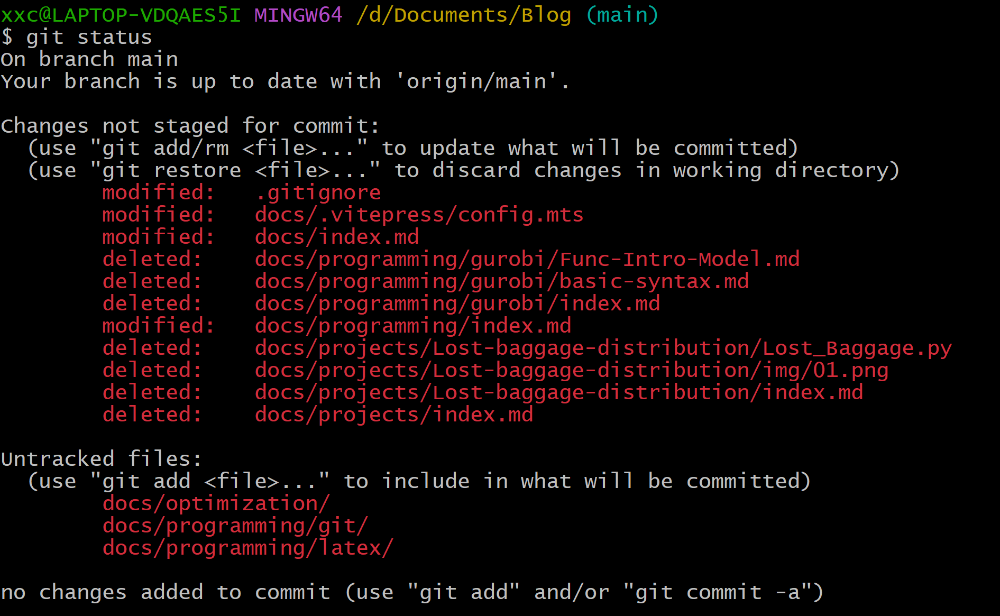
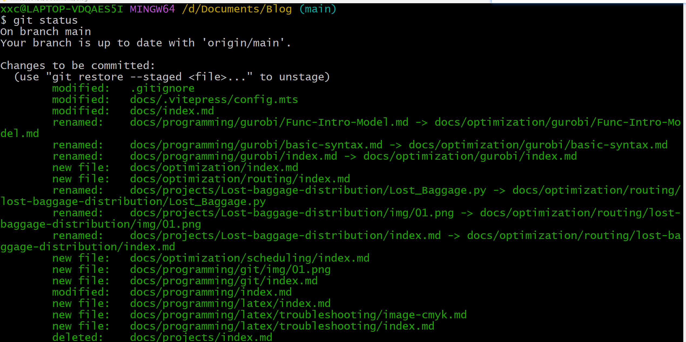
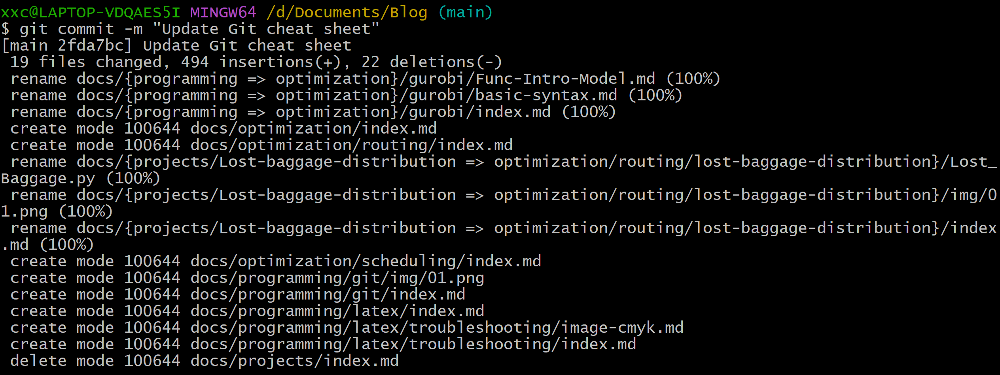
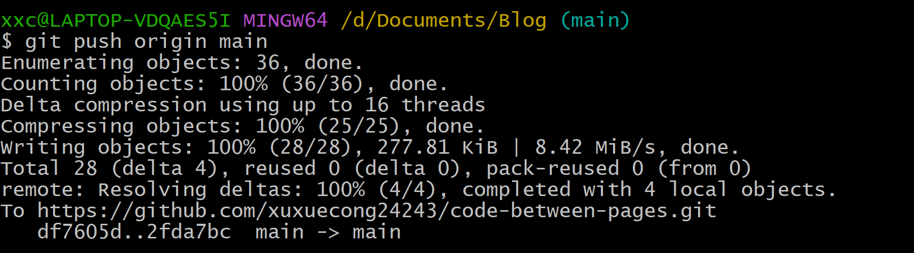

# 🌱 Git

记录日常开发中常用的 Git 命令及工作流程。

> 持续更新中……

---

## 完成某个模块修改后，如何提交代码至git?

### 1.查看有哪些文件被修改
输入
```bash
git status
```

输出

输出说明：
- **On branch main**：当前所在分支。
- **Your branch is up to date with 'origin/main'.**：本地与远程仓库同步。
- **modified**：已修改的文件。
- **deleted**：已删除的文件。
- **Untracked files**：新建但尚未纳入 Git 管理的文件，需要执行 `git add` 后才能提交。

### 2.添加至暂存区

添加全部
```bash
git add .
```
检查状态`git sgatus`，此时会显示`Changes to be committed:`


### 3.提交
```bash
git commit -m "简要说明此次修改内容"
```

说明
- **Commit ID**：本次提交的唯一标识。
- **files changed**：本次修改的文件数量。
- **insertions(+)/deletions(-)**：新增和删除的代码行数。
- **rename**：Git 识别为文件移动，历史记录会保留。
- **create mode**：新增文件。
- **delete mode**：删除文件。

### 4.推送到github
```bash
git push origin main
```

输出示例

输出说明：
- **Enumerating objects**：统计本次需要上传的对象（文件、提交等）。
- **Counting objects**：计算需要处理的对象数量。
- **Delta compression**：对数据进行差异压缩，减少上传体积。
- **Compressing objects**：压缩对象。
- **Writing objects**：开始上传对象到远程仓库。
- **Resolving deltas**：GitHub 在远程完成数据合并。
- **To ...**：显示推送的远程仓库地址。
- **df7605d..2fda7bc**：表示远程仓库从提交 `df7605d` 更新到了 `2fda7bc`。
- **main -> main**：本地 `main` 分支成功推送到远程 `main` 分支。

推送成功后，如果仓库配置了 GitHub Actions，通常会自动开始构建和部署。

## 📦 仓库初始化

```bash
git init
git clone <url>
```

---

## 📄 查看状态

```bash
git status
git log --oneline
git log --graph --oneline --all
git diff
```

---

## ➕ 提交代码

```bash
git add .
git commit -m "message"
git push origin main
```

---

## 🔄 拉取更新

```bash
git pull
git fetch
```

---

## 🌿 分支管理

```bash
git branch
git branch new-branch
git checkout new-branch
git switch new-branch
git checkout -b new-branch
git merge branch-name
git branch -d branch-name
```

---

## ↩️ 回退

### 撤销工作区修改

```bash
git restore file
```

### 撤销暂存

```bash
git restore --staged file
```

### 回退到指定版本

```bash
git reset --hard HEAD~1
```

---

## 🗑️ 删除文件

```bash
git rm file
git rm --cached file
```

---

## 🚫 .gitignore

忽略指定文件：

```gitignore
node_modules/
.vscode/
*.log
```

忽略模板：

```gitignore
**/.template.md
```

---

## 🚀 我的博客发布流程

```bash
git status
git add .
git commit -m "update blog"
git push origin main
```

GitHub Actions 自动部署。

---

## 💡 常用技巧

查看远程仓库：

```bash
git remote -v
```

修改远程仓库：

```bash
git remote set-url origin <url>
```

查看提交历史：

```bash
git log --oneline --graph
```

查看某个文件修改历史：

```bash
git log -- file.md
```