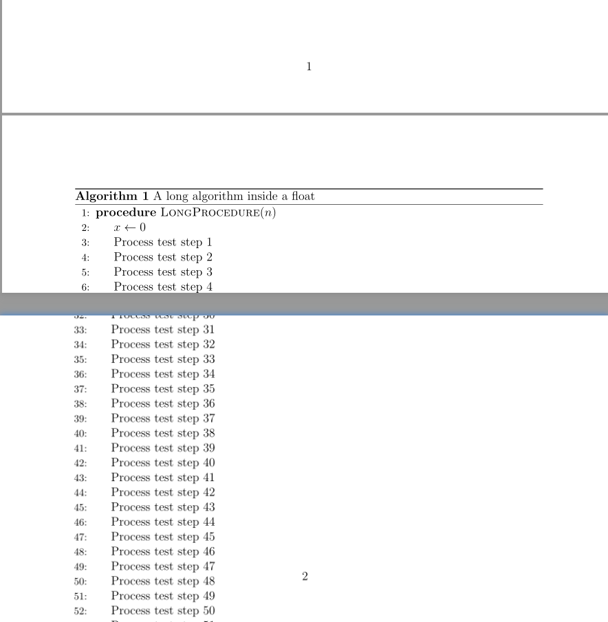
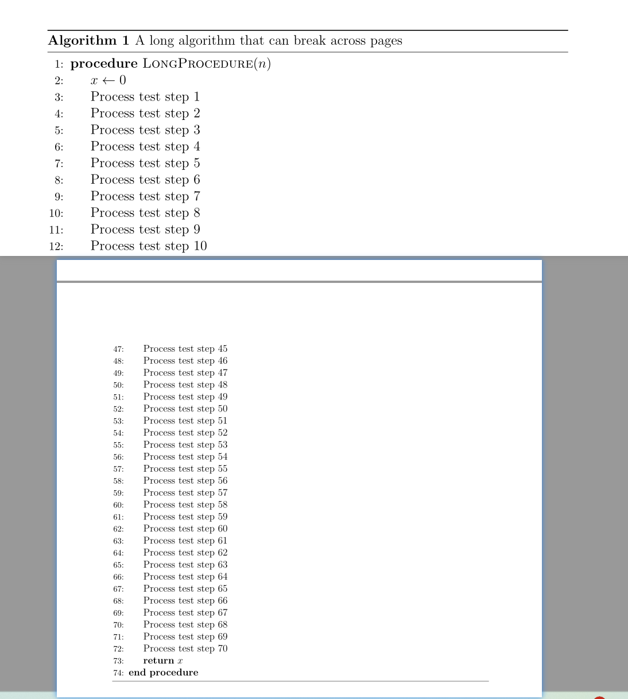

# LaTeX 伪代码分页

当伪代码较长时，LaTeX 可能会把整段伪代码移动到下一页；如果伪代码本身比一页还长，还可能超出页面，并出现 `Float too large for page` 警告。

本文使用的宏包组合为：

```latex
\usepackage{algorithm}
\usepackage{algpseudocode}
```

## 1. 伪代码为什么不能分页

下面是一个不能分页的最小测试示例：

```latex
\documentclass[12pt]{article}

\usepackage[a4paper,margin=2.5cm]{geometry}
\usepackage{algorithm}
\usepackage{algpseudocode}
\usepackage{pgffor} % 仅用于快速生成多行测试内容

\begin{document}

\begin{algorithm}[H]
  \caption{A long algorithm inside a float}
  \label{alg:no-page-break}
  \begin{algorithmic}[1]
    \Procedure{LongProcedure}{$n$}
      \State $x \gets 0$
      \foreach \i in {1,...,70}{%
        \State Process test step $\i$
      }
      \State \Return $x$
    \EndProcedure
  \end{algorithmic}
\end{algorithm}

\end{document}
```


其中，`algorithmic` 环境负责排版伪代码内容，外层的 `algorithm` 环境负责提供标题、编号和浮动功能。问题就在外层：`algorithm` 是一个与 `figure`、`table` 类似的浮动体，LaTeX 会把它作为一个整体排版，因此不能把它拆到两页。

即使写成 `\begin{algorithm}[H]`，也只是要求 LaTeX 尽量把整个浮动体放在当前位置，并不会使它支持分页。

运行结果示例
<div align="center">
  
</div>


## 2. 让伪代码自动分页

解决方法是：

1. 保留可以分页的 `algorithmic` 环境；
2. 去掉外层不可分页的 `algorithm` 浮动体；
  ::: info 浮动体
  浮动体是由 LaTeX 根据页面空间自动调整位置的排版对象，不一定严格出现在源码所在的位置，并且会作为一个整体排版，不能跨页拆分。
  :::
3. 使用 `\captionof{algorithm}` 在浮动体之外生成标题和编号。


完整的最小示例如下：

```latex
\documentclass[12pt]{article}

\usepackage[a4paper,margin=2.5cm]{geometry}
\usepackage{algorithm}
\usepackage{algpseudocode}
\usepackage{caption}
\usepackage{pgffor} % 仅用于快速生成多行测试内容

% 设置标题样式
\captionsetup[algorithm]{
  position=top,
  format=plain,
  labelfont=bf,              % “Algorithm 1”加粗
  labelsep=space,            % 编号与标题之间不加冒号
  justification=raggedright, % 标题左对齐
  singlelinecheck=false,
  skip=2pt
}

% 可分页的伪代码环境
\newenvironment{breakablealgorithm}
  {%
    \par
    \addvspace{\intextsep}%
    \hrule height .8pt depth 0pt\relax
    \kern 2pt
  }
  {%
    \kern 2pt
    \hrule
    \addvspace{\intextsep}%
  }

\begin{document}

\begin{breakablealgorithm}
  \captionof{algorithm}{A long algorithm that can break across pages}
  \label{alg:page-break}

  % 标题下方的横线
  \hrule
  \kern 2pt

  \begin{algorithmic}[1]
    \Procedure{LongProcedure}{$n$}
      \State $x \gets 0$

      \foreach \i in {1,...,70}{%
        \State Process test step $\i$
      }

      \State \Return $x$
    \EndProcedure
  \end{algorithmic}
\end{breakablealgorithm}

\end{document} 
```

当当前页面剩余空间不足时，`algorithmic` 中的伪代码会自然延续到下一页。`\captionof{algorithm}` 仍然会生成算法标题和编号，因此可以继续使用：

```latex
\label{alg:page-break}
```

并在正文中引用：

```latex
Algorithm~\ref{alg:page-break}
```
运行结果示例
<div align="center">
  
</div>

## 3. 在自己的论文中使用

首先把 `breakablealgorithm` 的定义放在导言区，然后把原来的代码：

```latex
\begin{algorithm}[H]
  \caption{My algorithm}
  \label{alg:my-algorithm}
  \begin{algorithmic}[1]
    % 伪代码内容
  \end{algorithmic}
\end{algorithm}
```

改为：

```latex
\begin{breakablealgorithm}
  \captionof{algorithm}{My algorithm}
  \label{alg:my-algorithm}
  \begin{algorithmic}[1]
    % 伪代码内容
  \end{algorithmic}
\end{breakablealgorithm}
```

伪代码主体不需要修改。

## 4. 注意事项

- 不要再在 `breakablealgorithm` 外面套一层 `algorithm`，否则内容仍然不能分页。
- 不要把它放进 `minipage`、`parbox` 或 `resizebox`，这些命令同样会把内容装入不可分页的盒子。
- `\label` 应放在 `\captionof{algorithm}` 后面，才能得到正确的算法编号。
- 示例中的 `pgffor` 只用于生成 70 行测试内容。替换为真实伪代码后，可以删除 `\usepackage{pgffor}` 和 `\foreach`。
- 本文方法适用于 `algorithm` 与 `algpseudocode` 的组合，不应直接套用到 `algorithm2e`。

## 5. 总结

LaTeX 伪代码不能分页，并不是因为 `algorithmic` 不能分页，而是因为它通常被放进了不可拆分的 `algorithm` 浮动体中。移除外层浮动体，再通过 `\captionof{algorithm}` 保留标题和编号，就可以让长伪代码自动跨页。

## 参考资料

- [The algorithms bundle](https://ctan.org/pkg/algorithms)
- [The algorithmicx package](https://ctan.org/pkg/algorithmicx)
- [The caption package](https://ctan.org/pkg/caption)