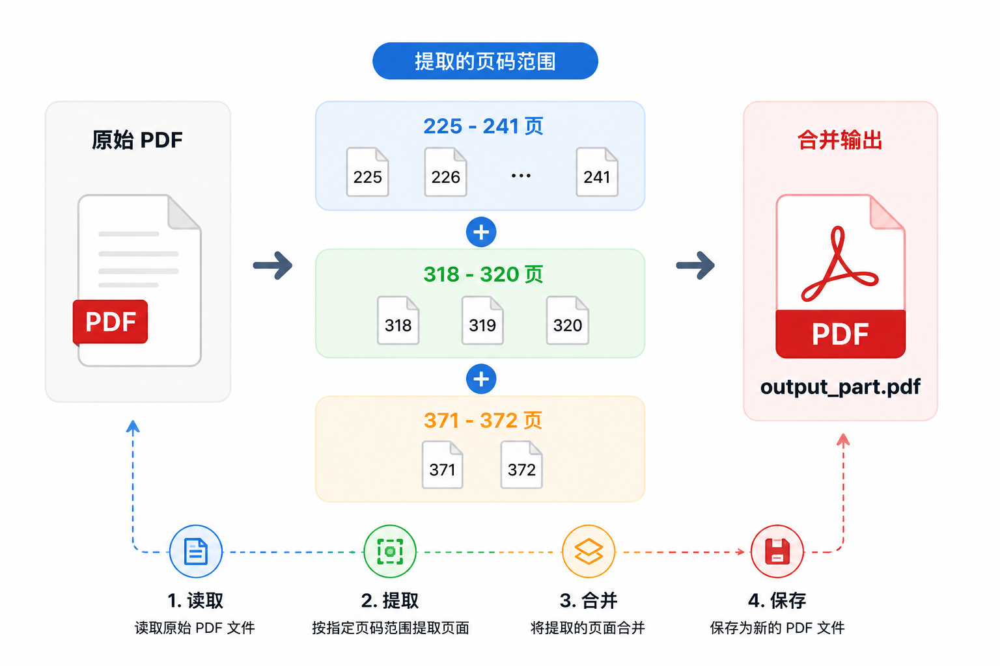
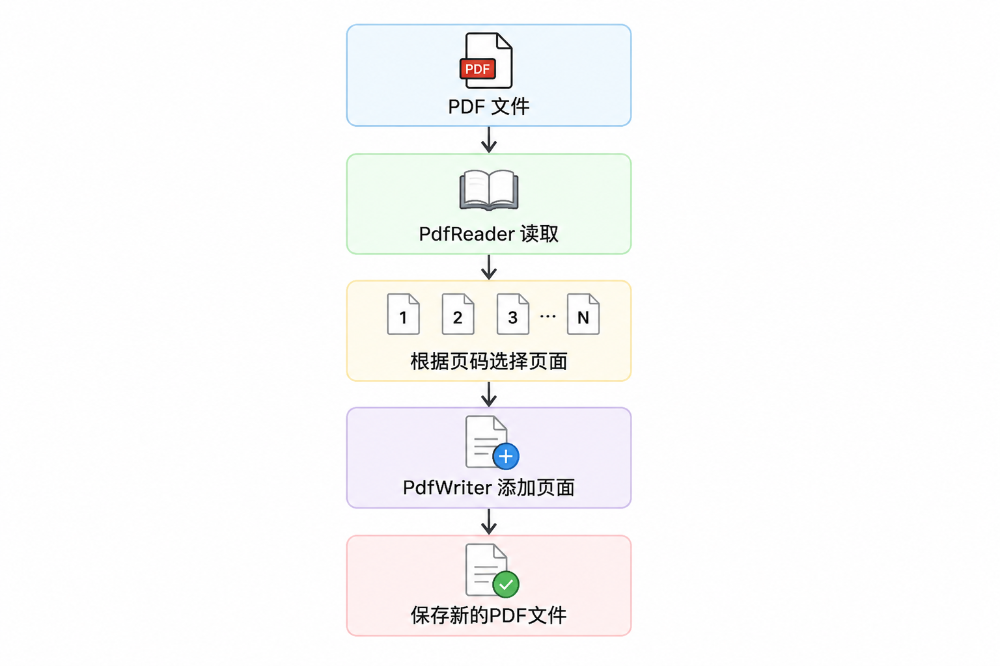

# 使用 Python 实现 PDF 指定页码提取工具

## 1. 背景

目前，很多技术书籍、教材以及论文资料都会以电子版 PDF 的形式进行保存。

但是在实际学习过程中，经常会遇到以下问题：

- 一本电子书可能包含几百页甚至上千页内容，但当前阶段只需要学习其中部分章节；
- 出门学习时，携带完整电子书不方便；
- 如果直接打印整本 PDF，不仅浪费纸张，也增加携带负担；
- 每次打印时手动输入页码范围，容易出现页码选择错误。

例如，一本数学建模教材：

```text
第3章：225-241页
第5章：318-320页
第7章：371-372页
```

实际学习过程中，只需要这些部分内容。

因此，希望实现一个简单的 Python 工具：

> 根据指定的页码范围，从原始 PDF 中提取需要的页面，并生成新的 PDF 文件。


## 2. 功能需求

本项目实现一个简单的 PDF 页面提取工具，主要功能如下。


### 2.1 根据指定页码范围提取页面

用户可以输入多个页码范围：

```python
page_ranges = [
    (225, 241),
    (318, 320),
    (371, 372)
]
```

表示提取：

- 第 225 页到第 241 页；
- 第 318 页到第 320 页；
- 第 371 页到第 372 页。


### 2.2 合并输出 PDF

当前版本会将多个页码范围提取后合并到同一个 PDF 文件中：

<div align="center">
  
</div>

方便后续打印或者单独阅读。


## 3. 环境准备

本项目使用 Python 实现，需要安装 `PyPDF2`。

安装依赖：

```bash
pip install PyPDF2
```

项目结构：

```text
pdf-toolbox
│
├── src
│   └── split_pdf.py
│
├── data
│   └── input.pdf
│
├── output
│   └── output_part.pdf
│
├── requirements.txt
└── README.md
```


## 4. 实现思路

<div align="center">
  
</div>

其中：

- `PdfReader` 用于读取已有 PDF；
- `PdfWriter` 用于创建新的 PDF 文件。


## 5. 核心代码分析


## 5.1 读取 PDF 文件

首先，通过 `PdfReader` 读取原始 PDF：

```python
reader = PdfReader(input_pdf)
```

读取后，可以通过：

```python
reader.pages
```

访问 PDF 中的所有页面。


例如：

```python
reader.pages[0]
```

表示 PDF 的第一页。


## 5.2 创建 PDF 写入对象

创建一个新的 PDF 写入对象：

```python
writer = PdfWriter()
```

需要注意：

此时并没有生成新的 PDF 文件。

`PdfWriter` 只是一个用于暂存页面的对象。


后续通过：

```python
writer.add_page()
```

向其中添加需要保存的页面。


## 5.3 根据页码范围提取页面

核心代码：

```python
for start_page, end_page in page_ranges:

    for page_num in range(start_page - 1, end_page):
        writer.add_page(reader.pages[page_num])
```

这里需要注意 PDF 页码和 Python 索引的区别。


用户输入：

```text
第225页
```

但是 Python 列表索引从 `0` 开始：

```python
reader.pages[224]
```

才对应 PDF 第 225 页。


因此：

```python
start_page - 1
```

用于完成页码转换。


## 5.4 保存新的 PDF 文件

最后：

```python
with open(output_pdf, "wb") as f:
    writer.write(f)
```

这里包含两个步骤。


### 第一步：创建输出文件

```python
open(output_pdf, "wb")
```

其中：

- `w` 表示写入模式；
- `b` 表示二进制模式。

由于 PDF 是二进制文件，因此使用：

```python
"wb"
```


### 第二步：写入 PDF 内容

```python
writer.write(f)
```

将 `PdfWriter` 中保存的页面写入文件。


最终生成：

```text
output_part.pdf
```


## 6. 完整代码

```python
# split_pdf.py
"""
用于实现 PDF 按多个页码区间提取并合并
思考：用户可以自己选择多个页码部分是合并还是单独生成文件，如何实现？
"""

import os
from PyPDF2 import PdfReader, PdfWriter


def extract_pdf_pages(input_pdf, page_ranges, output_pdf):
    """
    page_ranges 按实际页码填写，从 1 开始。

    例如：
    page_ranges = [(286, 288), (290, 297)]

    表示提取：
    第 286 页到第 288 页；
    第 290 页到第 297 页；
    然后合并输出到同一个 PDF。
    """

    reader = PdfReader(input_pdf)
    total_pages = len(reader.pages)

    writer = PdfWriter()

    for start_page, end_page in page_ranges:
        if start_page < 1 or end_page > total_pages or start_page > end_page:
            raise ValueError(
                f"页码范围错误：({start_page}, {end_page})，PDF 总页数为 {total_pages}"
            )

        for page_num in range(start_page - 1, end_page):
            writer.add_page(reader.pages[page_num])

    output_dir = os.path.dirname(output_pdf)
    if output_dir:
        os.makedirs(output_dir, exist_ok=True)

    with open(output_pdf, "wb") as f:
        writer.write(f)

    print(f"已输出：{output_pdf}")


if __name__ == "__main__":

    input_pdf = "../data/input.pdf"
    output_pdf = "../data/output_part.pdf"

    # 需要提取的多个页码范围
    # 注意：一定要是PDF文件的实际页码，不是PDF标注的页码
    page_ranges = [
        (275, 276),
        (318,320),
        (371,372)
    ]

    extract_pdf_pages(input_pdf, page_ranges, output_pdf)
```


## 7. 使用过程中遇到的问题


## PDF页码与书籍页码不一致

实际使用时，经常会遇到：

```text
书籍显示页码：225页

PDF阅读器显示：240页
```

这是因为 PDF 文件通常包含：

- 封面；
- 目录；
- 前言；
- 版权页。


因此程序中的页码：

> 必须使用 PDF 文件实际显示的页码，而不是书籍印刷页码。


## 8. 后续优化方向

当前版本实现：

- 根据指定页码范围提取 PDF；
- 支持多个页码范围；
- 合并生成新的 PDF 文件。


未来计划：

- 支持多个页码范围分别生成文件；
- 支持 PDF 合并；
- 支持 PDF 压缩；
- 支持 PDF 转图片；
- 增加命令行参数；
- 增加简单图形界面。


## 9. 总结

本文使用 Python 和 `PyPDF2` 实现了一个简单的 PDF 页面提取工具。

虽然代码规模不大，但是解决了学习过程中的一个实际问题：

> 将大型电子书转换为适合个人学习和打印的小型 PDF 文件。


后续将继续完善该项目，将其扩展为一个面向学习和科研场景的 PDF 工具箱。


项目地址：

GitHub: [pdf-toolbox](https://github.com/xuxuecong24243/pdf-toolbox)