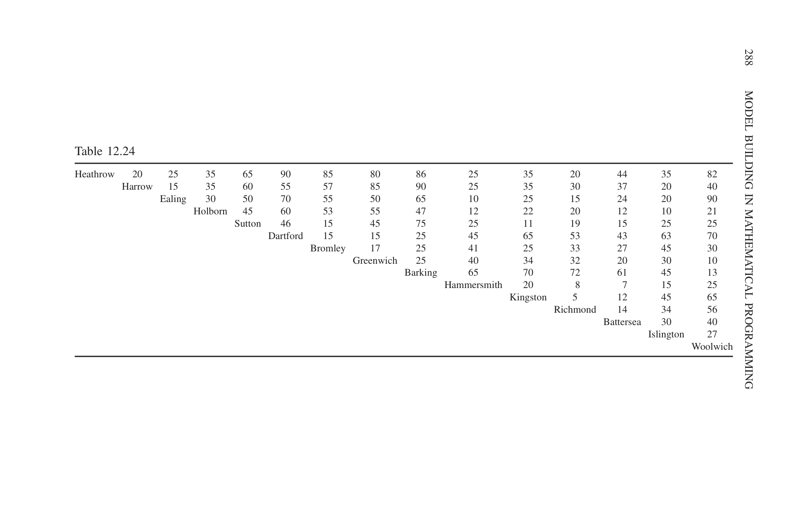
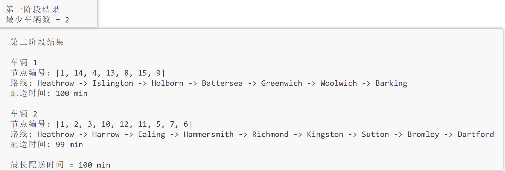

# 遗失行李分配（Lost Baggage Distribution）

## 1. 项目简介

机场每天都会产生一定数量的遗失或延误行李，需要在规定时间内配送至旅客指定地点。如何合理规划车辆数量及配送路线，在满足配送时限的前提下完成所有配送任务，是物流配送领域中的一个典型优化问题。
本项目基于《Model Building in Mathematical Programming》中的**Lost Baggage Distribution**案例，对遗失行李配送问题进行建模与求解。问题要求在满足所有行李均在规定时间内完成配送的前提下，首先最小化所需车辆数量；在车辆数量最少的条件下，再进一步最小化所有车辆中最长的配送时间。
该问题属于经典**车辆路径问题（Vehicle Routing Problem，VRP）**
的一个简化变体。与传统的容量约束车辆路径问题（CVRP）相比，本案例不考虑车辆容量限制；与带时间窗车辆路径问题（VRPTW）相比，仅要求所有配送任务在整体时间限制内完成，而不设置每个客户独立的服务时间窗。因此，该案例非常适合作为学习整数规划建模、车辆路径优化以及 Python 求解器应用的入门项目。

## 2. 问题描述
某物流公司有6辆货车，负责每天18：00从**Heathrow（希思罗）机场**领取航空公司的遗失或延误行李，并配送至伦敦地区的客户。为了提升客户满意度，合同要求在120分钟内（注：不包含完成最后一个配送任务返回机场的时间）完成所有客户的行李配送任务。在该案例中，我们有以下假设：
- 每辆车的容量没有限制；
- 不考虑卸货的时间。

教材给出了Heathrow机场及各配送地点之间的行驶时间（单位：分钟），如下表所示。

  

<b>表 1.</b> 配送地点之间的行驶时间（单位：min）

由上表可知，本案例包含**1个配送中心（Heathrow）**和**14个配送地点**。所有车辆均从Heathrow出发，只需完成各自分配的配送任务，最后不需要返回配送中心（返回配送中心的时间记作0）。因此，每条配送路线均表示为一条**起点固定、终点为某一配送地点的路径**。

该问题采用两阶段优化目标：

1. **最小化所需配送车辆数量，使得在规定时间内将行李配送给每一个客户；**
2. **在车辆数量最少的前提下，最小化所有车辆中的最长配送时间。**

该问题可以看作经典**车辆路径问题（Vehicle Routing Problem，VRP）**
的一个简化变体，其目标是在满足配送时限约束的前提下，实现配送车辆的合理调度与路径优化。

>**说明：**本项目来源于《Model Building in Mathematical Programming》中的**Lost Baggage Distribution**案例，本文对该问题进行建模实现、求解分析与项目复盘。

## 3 问题分析

从问题特征来看，本案例属于经典**车辆路径问题（Vehicle Routing Problem，VRP）**。车辆需要从同一个配送中心出发，对多个配送地点完成配送任务，并合理规划每辆车的服务客户及访问顺序，因此本质上属于多车辆路径规划问题。

与经典VRP相比，本案例具有以下特点：

- **不考虑车辆容量约束。**
  题目假设每辆配送车辆均具有充足的装载能力，因此无需限制每辆车能够配送的行李数量，也无需引入容量约束。

- **不考虑客户时间窗。**
  所有行李均在18:00从Heathrow发出，仅要求所有配送任务在20:00前完成，而没有规定每个客户的独立配送时间，因此不存在传统车辆路径问题中的客户时间窗约束。

- **车辆无需返回配送中心。**
  每辆车均从Heathrow出发，在完成最后一个配送任务后即可结束配送，返回配送中心的时间不计入配送时长。因此，每条配送路线均表示为一条**起点固定、终点不固定的路径（Path）**，而不是要求首尾相连的回路（Cycle）。

综合以上特点，本案例可视为**无容量约束、无客户时间窗且无需返回配送中心**的车辆路径问题。模型需要同时解决三个关键决策：**1.使用的车辆数；2.每辆车的配送客户集合；3.配送顺序**。在满足所有配送任务均于规定时间内完成的前提下，首先最小化车辆使用数量，再进一步优化最长配送时间。

## 4 数学建模

本节将该问题建模为一个整数规划模型。模型的核心思想是：用二进制变量表示车辆是否被使用、客户是否由某辆车服务，以及车辆是否从一个地点直接行驶到另一个地点。

### 4.1 集合与参数

设：

- $N = \{1,2,\dots,n\}$表示所有地点集合，其中地点$1$表示Heathrow，其他地点表示需要配送的客户，本案例中$n=15$；
- $K = \{1,2,\dots,m\}$表示可用车辆集合，本案例中$m=6$；
- $c_{ij}$表示地点$i$到地点$j$的行驶时间；
- $T$表示每辆车允许的最大配送时间，本案例中$T=120$。

### 4.2 决策变量

定义如下0-1决策变量：

$$
x_{ijk} =
\begin{cases}
1, & \text{若车辆} k \text{从地点} i \text{直接行驶到地点} j,\\
0, & \text{否则。}
\end{cases}
$$

$$
y_{ik} =
\begin{cases}
1, & \text{若地点} i \text{由车辆} k \text{访问，}\\
0, & \text{否则。}
\end{cases}
$$

$$
\delta_k =
\begin{cases}
1, & \text{若车辆} k \text{被使用，}\\
0, & \text{否则。}
\end{cases}
$$

其中，$x_{ijk}$用于描述车辆的行驶路径，$y_{ik}$用于描述客户与车辆之间的分配关系，$\delta_k$用于表示车辆是否投入使用。

### 4.3 第一阶段目标函数：最小化车辆数

第一阶段目标是最小化实际使用的车辆数量：

$$
\min \sum_{k \in K} \delta_k
$$

该目标对应原问题中的首要要求，即在满足120分钟配送时限的前提下，尽可能减少投入使用的配送车辆数量。

### 4.4 约束条件

#### 1. 车辆使用约束

如果某个客户由车辆$k$访问，则车辆$k$必须被使用：

$$
y_{ik} \leq \delta_k, \quad \forall i \in N \setminus \{1\},\ k \in K
$$

#### 2. 配送时间约束

对于任意车辆，完成配送任务的时间不超过120分钟（返回heathrow的时间不计入）：

$$
\sum_{i\in N}\sum_{\substack{j\in N\\ j\ne i,\ j\ne 1}} c_{ij}x_{ijk}\le T,
\quad \forall k\in K
$$

#### 3. 客户唯一服务约束

每个客户必须且只能由一辆车服务：

$$
\sum_{k \in K} y_{ik} = 1,
\quad \forall i \in N \setminus \{1\}
$$

#### 4. 配送中心访问约束

若车辆$k$被使用，则该车辆必须从Heathrow出发：

$$
y_{1k} = \delta_k,
\quad \forall k \in K
$$

#### 5. 流入约束

如果车辆$k$访问地点$j$，则必须有一条进入地点$j$的弧：

$$
\sum_{i \in N, i \ne j} x_{ijk} = y_{jk},
\quad \forall j \in N,\ k \in K
$$

#### 6. 流出约束

如果车辆$k$访问地点$j$，则必须有一条从地点$j$离开的弧：

$$
\sum_{i \in N, j \ne i} x_{jik} = y_{jk},
\quad \forall i \in N,\ k \in K
$$

### 4.5 对称性破除约束

由于车辆之间是同质的，交换车辆编号不会改变实际配送方案。为了减少等价解，可以加入如下对称性破除约束：

$$
\sum_{i \in N} y_{i1}
\geq
\sum_{i \in N} y_{i2}
\geq
\cdots
\geq
\sum_{i \in N} y_{i6}
$$

该约束要求编号较小的车辆服务的地点数不少于编号较大的车辆，从而减少因车辆编号互换产生的对称解。

### 4.6 子回路消除

仅使用上述流平衡约束时，模型可能产生不经过Heathrow的独立子回路。例如，某几个客户之间形成一个闭合路线，但该路线并没有与配送中心相连。这种情况在车辆路径问题中称为**subtour**。
因此，需要额外加入**子回路消除约束**，确保每辆车的配送路线都是从Heathrow出发并连接所有由该车辆服务的客户，而不是由多个相互独立的回路组成。
在实际实现中，可以采用MTZ约束或动态添加 subtour elimination constraints 的方式处理该问题。

### 4.7 第二阶段目标函数：最小化最长配送时间

在第一阶段求得最少车辆数量后，将车辆使用数量固定为最优值，再进行第二阶段优化。

设$Z$表示所有车辆中的最长配送时间，则第二阶段目标为：

$$
\min Z
$$

并加入约束：

$$
\sum_{i \in N}\sum_{j \in N, j \ne i} c_{ij}x_{ijk} \leq Z,
\quad \forall k \in K
$$

同时保持第一阶段得到的最少车辆数量不变：

$$
\sum_{k \in K} \delta_k = V^*
$$

其中，$V^*$表示第一阶段求得的最少车辆数量。

因此，完整求解过程可以概括为：

1. 首先求解模型，得到最少车辆数$V^*$；
2. 固定车辆数为$V^*$；
3. 在该条件下最小化最长配送时间$Z$。

## 5 Python实现

<<< ./Lost_Baggage.py

## 6 求解结果

  

<b>图 1.</b> 运行结果

