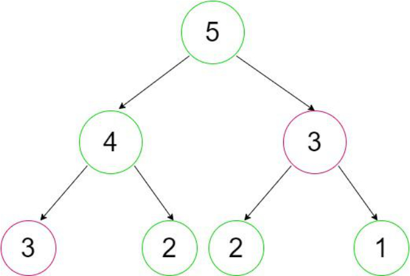

# 动态规划（Dynamic Programming）入门：从递归到动态规划[^gfg]

> 阅读本文后，你将了解：
>
> - 什么是动态规划（Dynamic Programming，DP）？
> - 什么样的问题适合使用动态规划？
> - 为什么动态规划能够显著提高算法效率？
> - 什么是最优子结构（Optimal Substructure）和重叠子问题（Overlapping Subproblems）？
> - 动态规划有哪些常见实现方式？

动态规划（Dynamic Programming，简称 **DP**）是算法设计中最重要的思想之一，也是初学算法时最容易感到抽象的内容之一。

很多人在第一次学习动态规划时，都会记住一句话：

> **动态规划 = 递推 + 数组。**

实际上，这种理解并不准确。动态规划真正的核心并不是递推，也不是数组，而是**将一个复杂问题拆分为若干规模更小的子问题，并避免对相同子问题进行重复求解**。

为了理解这一思想，我们先来看一个最经典的例子——斐波那契数列。

## 从递归开始

斐波那契数列定义如下：

$$
\operatorname{Fib}(0)=0,\qquad
\operatorname{Fib}(1)=1,
$$

对于任意 $n\ge2$，

$$
\operatorname{Fib}(n)
=
\operatorname{Fib}(n-1)
+
\operatorname{Fib}(n-2).
$$

根据这一递推关系，很容易写出递归程序：

```python
def fib(n):
    if n <= 1:
        return n
    return fib(n - 1) + fib(n - 2)
```

这段代码非常简洁，也完全符合数学定义。然而，当 $n$ 稍微增大时，程序运行速度会迅速下降。

例如，计算 `fib(5)` 时的递归调用过程如下图所示。

<div align="center">

</div>


从递归树中可以看到，同一个子问题会在不同的递归分支中反复出现：

- `fib(3)` 被计算了两次；
- `fib(2)` 被计算了两次；
- 随着 $n$ 不断增大，这种重复计算会越来越严重。

因此，朴素递归的分支结构会反复求解相同的子问题，从而造成大量重复计算，导致算法效率较低。

对于 $\operatorname{Fib}(n)$，不同的子问题实际上只有

$$
\operatorname{Fib}(0),
\operatorname{Fib}(1),
\ldots,
\operatorname{Fib}(n),
$$

共 $n+1$ 个。如果让每个不同的子问题只求解一次，算法的时间复杂度就可以从指数级降低到线性级。

为此，可以采用两种方法：

- 在自顶向下的递归过程中，保存已经求得的子问题结果。当再次需要同一子问题时，直接读取已有结果。这种方法称为**记忆化搜索（Memoization）**。
- 根据子问题之间的依赖关系，从基本情况开始，按照适当的顺序依次计算各个状态。这种方法称为**自底向上动态规划（Bottom-Up Dynamic Programming）**。

两种方法虽然计算顺序不同，但目的相同：避免重复求解同一个子问题。

::: tip 动态规划的基本思想

动态规划将原问题分解为若干较小的子问题，利用子问题之间的依赖关系逐步求得原问题的解，并通过保存或有序计算子问题的结果来避免重复求解。

:::

## 什么样的问题适合使用动态规划？

并不是所有问题都适合使用动态规划。通常来说，一个问题适合使用动态规划，需要具备以下两个核心性质：

1. **最优子结构（Optimal Substructure）**
2. **重叠子问题（Overlapping Subproblems）**

这两个性质回答的是不同的问题：

| 性质       | 回答的问题                                 | 作用                                           |
| :--------- | :----------------------------------------- | :--------------------------------------------- |
| 最优子结构 | 能否通过子问题的最优解构造原问题的最优解？ | 为利用子问题的最优解求得原问题的最优解提供依据 |
| 重叠子问题 | 相同的子问题是否会反复出现？               | 使记忆化或状态存储能够减少重复求解             |

换句话说：

- **最优子结构决定动态规划是否可行。**
- **重叠子问题决定动态规划是否能够通过保存结果提高效率。**

### 最优子结构（Optimal Substructure）

如果一个问题的最优解可以由若干规模更小子问题的最优解组合得到，那么称该问题具有**最优子结构**。

也就是说，当我们已经知道较小子问题的最优解时，就能够利用这些结果构造原问题的最优解，而不需要重新求解整个问题。

以斐波那契数列为例，根据

$$
\operatorname{Fib}(n)
=
\operatorname{Fib}(n-1)
+
\operatorname{Fib}(n-2),
$$

只要已经求得 $\operatorname{Fib}(n-1)$ 和 $\operatorname{Fib}(n-2)$，就可以得到 $\operatorname{Fib}(n)$。例如，

$$
\operatorname{Fib}(5)
=
\operatorname{Fib}(4)
+
\operatorname{Fib}(3)
=3+2=5.
$$

规模较大的问题能够由规模较小问题的解直接构造出来，这体现了最优子结构。

::: tip 核心理解

最优子结构强调的是**子问题的解能否用于构造原问题的解**。

:::

### 重叠子问题（Overlapping Subproblems）

重叠子问题是指：在将原问题分解为较小子问题时，不同的分解路径会产生相同的子问题。

在前面的递归树中，`Fib(3)` 和 `Fib(2)` 都会从不同的递归分支中多次出现。这说明斐波那契数列具有重叠子问题。

这里需要区分两个概念：

- **相同子问题反复出现**，是问题具有重叠子问题这一性质；
- **相同子问题被反复求解**，是朴素递归处理这类问题时产生的重复计算。

动态规划将每个不同的子问题表示为一个状态：

- 记忆化搜索在第一次求得某个状态后保存其结果，之后再次访问时直接读取；
- 自底向上动态规划按照状态之间的依赖关系安排计算顺序，使每个状态只需求解一次。

因此，重叠子问题为动态规划提高效率提供了可能：朴素递归中反复出现的相同子问题，在动态规划中只需要求解一次。

::: tip 核心理解

重叠子问题强调的是**不同的分解路径是否会产生相同的子问题**。

:::

### 为什么需要这两个性质？

如果一个问题存在重复计算，但较小子问题的最优解无法构成原问题的最优解，那么即使保存所有子问题的结果，也无法保证最终答案正确。

反过来，如果一个问题具有最优子结构，但各个子问题彼此独立、不会重复出现，那么保存计算结果也不会带来明显收益，此时通常采用分治算法即可。

::: warning 小结

- 最优子结构保证能够利用子问题的最优解构造原问题的最优解；
- 重叠子问题使保存子问题结果能够减少重复求解。

因此，动态规划通常适用于同时具有最优子结构和重叠子问题的问题。

:::

## 动态规划的两种实现方式

动态规划通常有两种经典实现方式：

1. 自顶向下（Top-Down），也称**记忆化搜索（Memoization）**；
2. 自底向上（Bottom-Up），也称**制表法（Tabulation）**。

它们利用的是相同的动态规划思想，区别主要在于子问题的求解顺序。

### 自顶向下（Top-Down，Memoization）

自顶向下方法仍然采用递归，但每次求解子问题之前，都会先检查该子问题是否已经计算过。

- 如果已经存在结果，则直接返回；
- 如果尚未计算，则继续递归，并保存计算结果。

```python
def fib(n, memo):
    if n <= 1:
        return n

    if memo[n] != -1:
        return memo[n]

    memo[n] = fib(n - 1, memo) + fib(n - 2, memo)
    return memo[n]
```

使用时，先建立记忆数组：

```python
memo = [-1] * (n + 1)
result = fib(n, memo)
```

因此，每个子问题最多只会被真正计算一次。

::: tip Top-Down 的特点

✔ 思路与递归一致，容易理解。

✔ 只计算真正需要访问的状态。

✘ 仍然需要递归，因此存在函数调用开销。

:::

### 自底向上（Bottom-Up，Tabulation）

自底向上方法不再使用递归，而是从基本状态开始，按照状态之间的依赖关系依次计算。

对于斐波那契数列，可以先求得 `Fib(0)` 和 `Fib(1)`，再依次计算 `Fib(2)`、`Fib(3)`，直到 `Fib(n)`。

```python
def fib(n):
    if n <= 1:
        return n

    dp = [0] * (n + 1)
    dp[0] = 0
    dp[1] = 1

    for i in range(2, n + 1):
        dp[i] = dp[i - 1] + dp[i - 2]

    return dp[n]
```

::: tip Bottom-Up 的特点

✔ 不需要递归，没有函数调用开销。

✔ 通常运行效率略高。

✔ 更容易进行空间优化。

✘ 需要事先确定状态的计算顺序。

:::

### 空间优化

根据状态转移方程

$$
\operatorname{Fib}(i)
=
\operatorname{Fib}(i-1)
+
\operatorname{Fib}(i-2),
$$

计算当前状态时只需要前两个状态，因此无需保存整个数组。

```python
def fib(n):
    if n <= 1:
        return n

    prev2 = 0
    prev1 = 1

    for _ in range(2, n + 1):
        curr = prev1 + prev2
        prev2 = prev1
        prev1 = curr

    return prev1
```

这样可以将空间复杂度从 $O(n)$ 优化为 $O(1)$。

## 各种方法的比较

| 方法                 | 求解方式     | 状态计算方式                     | 时间复杂度 | 空间复杂度 |
| :------------------- | :----------- | :------------------------------- | :--------- | :--------- |
| 普通递归             | 自顶向下递归 | 相同状态可能被反复计算           | $O(2^n)$   | $O(n)$     |
| 记忆化搜索           | 自顶向下递归 | 只计算实际访问的状态，并保存结果 | $O(n)$     | $O(n)$     |
| 自底向上动态规划     | 迭代         | 按依赖顺序依次计算状态           | $O(n)$     | $O(n)$     |
| 空间优化后的动态规划 | 迭代         | 只保留当前计算所需的状态         | $O(n)$     | $O(1)$     |

三种基本方法之间存在自然的演化关系：

```text
数学递推关系
        │
        ▼
     暴力递归
        │
        ▼
发现重叠子问题
        │
        ▼
加入缓存，得到记忆化搜索
        │
        ▼
分析状态依赖关系
        │
        ▼
自底向上动态规划
```

因此，记忆化搜索和自底向上动态规划并不是两种完全不同的算法，而是实现动态规划思想的两种方式。

::: tip 学习建议

对于大多数动态规划问题，可以按照下面的步骤思考：

1. 写出递归关系；
2. 确定子问题和状态；
3. 判断是否存在最优子结构和重叠子问题；
4. 选择记忆化搜索或自底向上的方式实现。

:::

## 总结

动态规划是一种将复杂问题分解为较小子问题，并通过保存或有序计算子问题的结果来避免重复求解的算法设计思想。

对于一个问题而言：

- **最优子结构**保证能够利用子问题的最优解构造原问题的最优解；
- **重叠子问题**使保存子问题结果能够减少重复求解。

动态规划主要有两种实现方式：

- **自顶向下（Top-Down）**：记忆化搜索（Memoization）；
- **自底向上（Bottom-Up）**：制表法（Tabulation）。

无论采用哪种方式，本质上都是利用子问题之间的依赖关系，避免对同一个子问题进行重复求解。

---

## References

[^gfg]: GeeksforGeeks. *How Does Dynamic Programming Work?*. https://www.geeksforgeeks.org/dsa/how-does-dynamic-programming-work/
