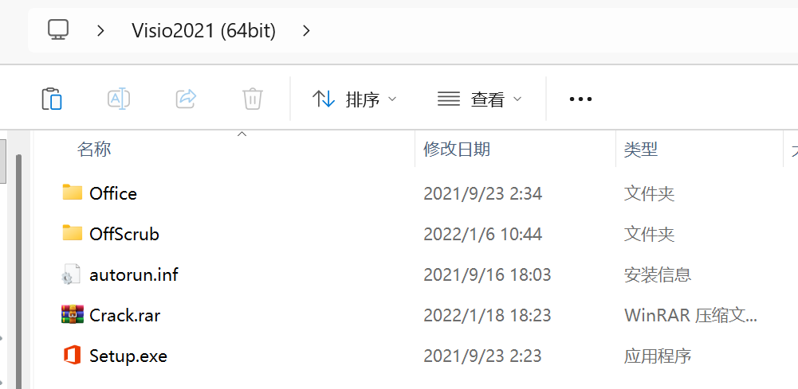
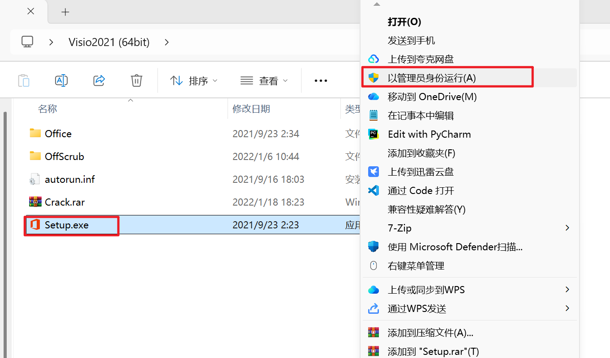
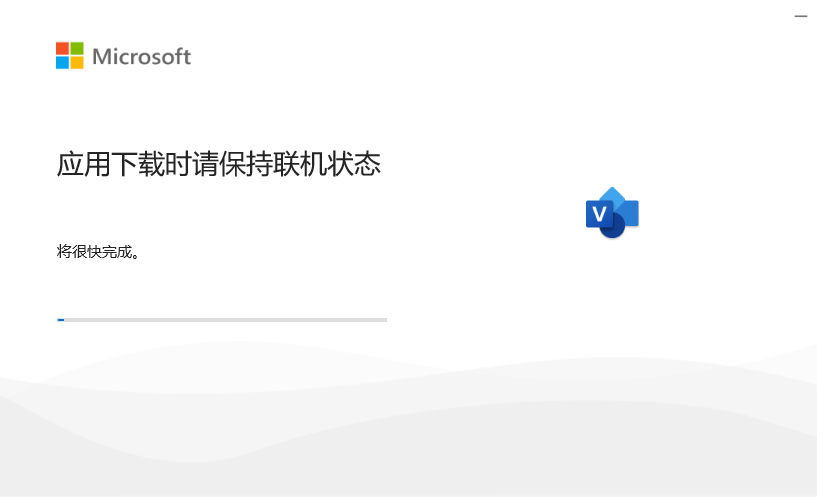
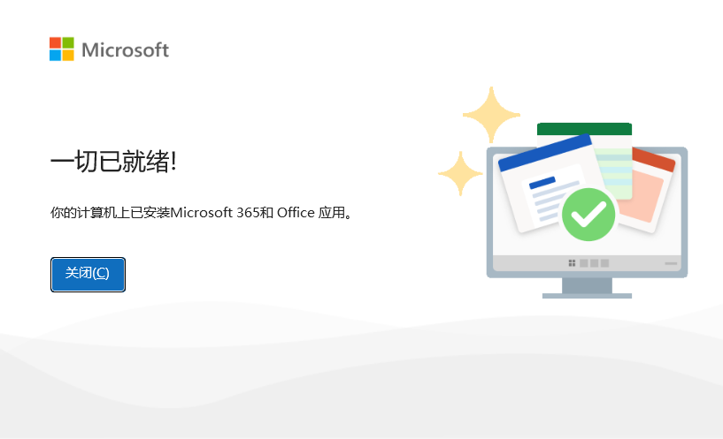
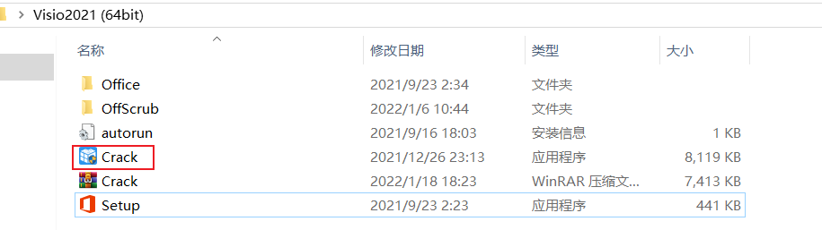
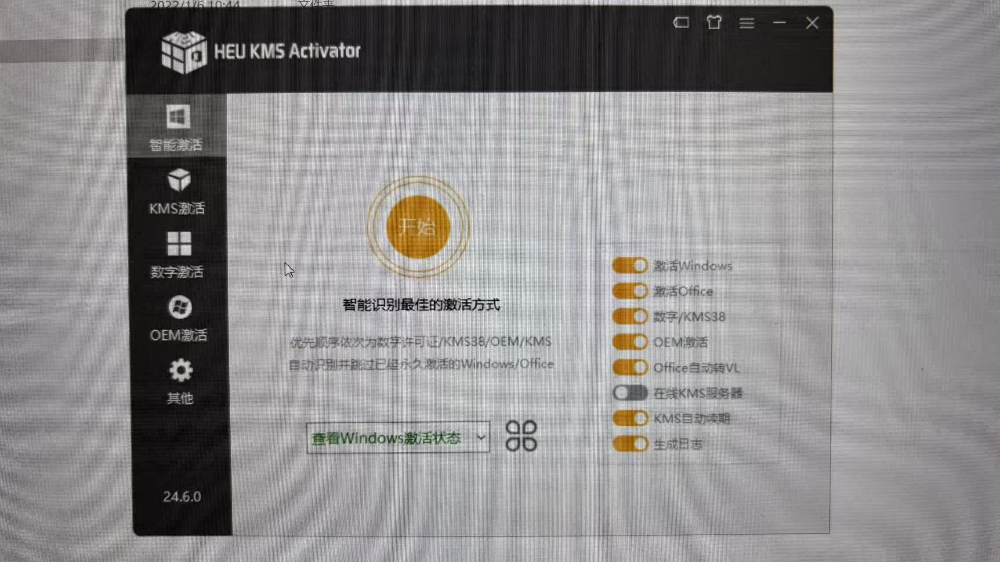
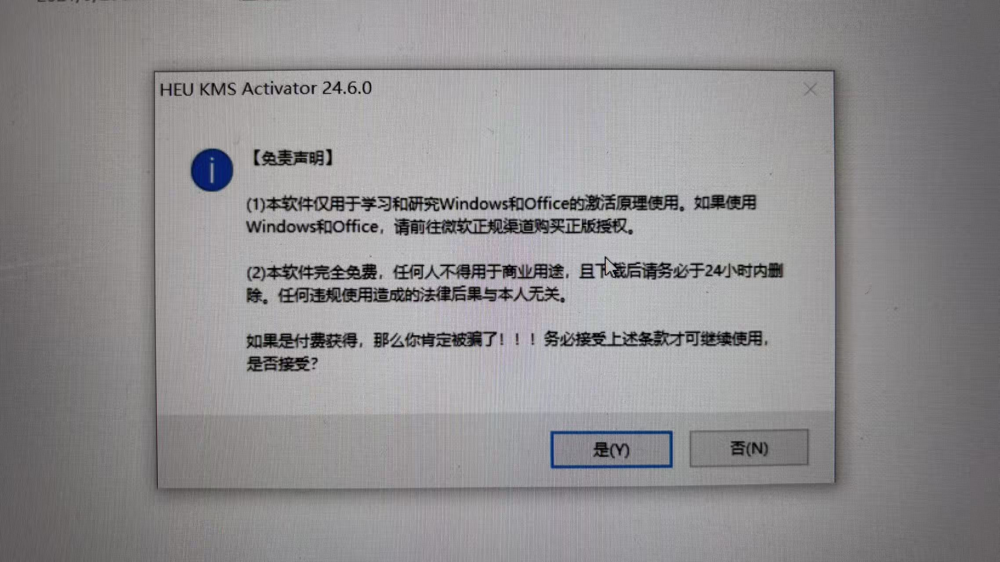
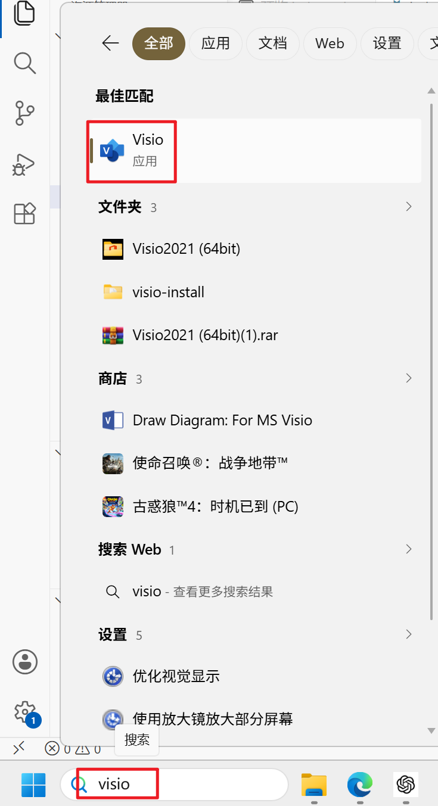
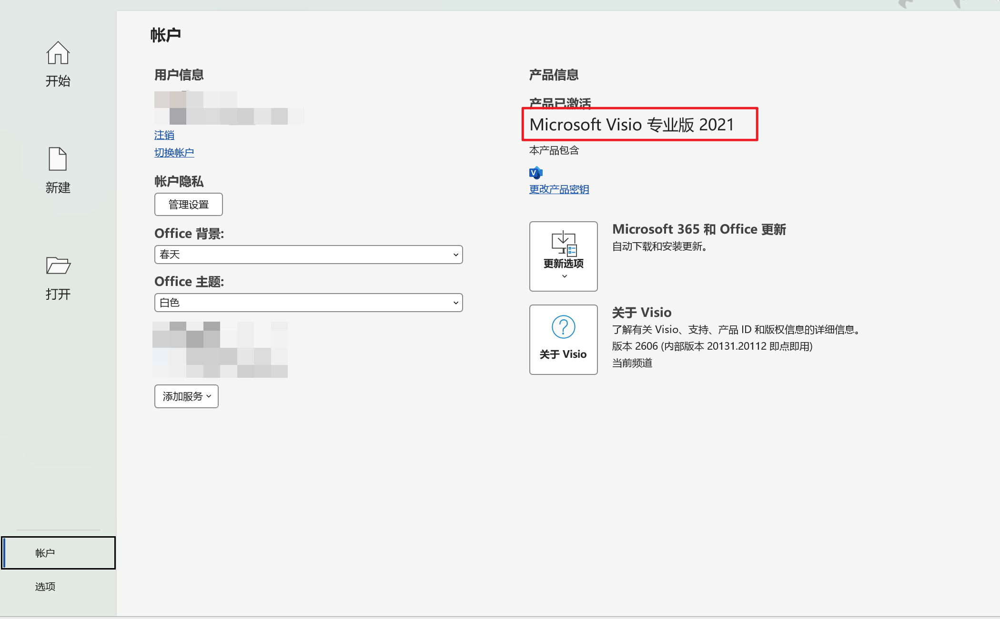

# Visio 2021 安装教程（Windows 图文详解）

> Microsoft Visio是一款专业的流程图和图表绘制软件，广泛应用于流程设计、网络拓扑、组织架构图等场景。本文以 Windows 11为例，介绍Visio 2021的下载安装流程，并整理常见安装问题，帮助首次安装的用户快速完成部署。

> **提示**
>
> - 建议安装前关闭杀毒软件，避免安装过程中被误拦截。
> - 如果电脑已经安装Microsoft Office，请确认Office Visio的版本是否兼容。
> - 建议使用管理员权限运行安装程序。

---

## 目录

- 一、适用版本
- 二、准备工作
- 三、安装步骤
- 四、常见问题
- 五、总结

---

# 一、适用版本

本教程适用于以下环境：

- 操作系统：Windows 11（Windows 10 同样适用）
- 软件版本：Microsoft Visio 2021

---

# 二、准备工作

安装前请确认以下内容：

- 已下载Visio安装包
- 电脑拥有管理员权限
- 关闭杀毒软件（建议）
- 确认磁盘空间充足
- 如已安装Office，请确认版本兼容

## 2.1 下载资源

本教程使用的软件版本：

- 软件：Microsoft Visio 2021
- 操作系统：Windows 11

### 官方下载（推荐）

如果你拥有Microsoft 365 Visio正版许可证，建议直接通过Microsoft官网下载安装。

官网：
https://www.microsoft.com/zh-cn/microsoft-365/visio/flowchart-software

### 网盘下载

```
通过网盘分享的文件：Visio2021 (64bit).rar
链接: https://pan.baidu.com/s/1-c1qblzO_sE181TxAniN2A?pwd=ujjw 提取码: ujjw 
```

---

# 三、安装步骤

## 3.1 下载并解压安装包

下载完成并解压后得到如下文件：




---

## 3.2 开始安装

找到安装程序：

```
Setup.exe
```

右键选择：

> 以管理员身份运行



随后等待安装程序启动。

> 安装过程中无需手动设置安装路径，默认配置即可完成安装。

---

## 3.3 等待安装完成

安装过程中无需进行其他操作。



等待进度条完成（大概需要10分钟）。

---

## 3.4 安装完成

安装成功后会提示：

```
一切已就绪
```



点击关闭即可。

---

## 3.5 激活

解压Crack压缩包（需要关闭杀毒软件）



点击开始



点击“是”



等待激活即可

## 3.5 验证是否安装成功

点击：

```
开始菜单
```

搜索：

```
Visio
```

打开软件。

新建一个空白绘图。

如果能够正常打开并保存文件，则说明安装成功。



也可以点击

```
账户
```

在右侧可看到产品已激活



---

# 四、常见问题

## 4.1 已安装 Office，为什么不能安装 Visio？

可能原因：

- Office 与 Visio 版本不同
- Office 为 Microsoft Store 版本
- Office 位数（32 位 / 64 位）不一致

建议：

- 保持 Office 与 Visio 为相同版本
- 保持相同位数
- 必要时卸载后重新安装

---

## 4.2 安装失败怎么办？

建议依次检查：

- 是否关闭杀毒软件
- 是否使用管理员权限运行
- 安装包是否完整
- Windows 是否缺少更新

如果仍无法安装，可以重新下载安装包后再次尝试。

---

## 4.3 软件无法打开

可以尝试：

- 重启电脑
- 修复Office
- 重新安装Visio

---

## 4.4 如何卸载？

打开：

```
控制面板
→ 程序和功能
```

找到：

```
Microsoft Visio 2021
```

点击：

```
卸载
```

即可完成卸载。

---

# 五、总结

本文介绍了：

✔ 下载方式

✔ 安装流程

✔ 激活说明

✔ 常见问题

如果安装过程中遇到新的问题，欢迎留言交流，本文也会持续更新。

---

## 更新记录

| 日期 | 更新内容 |
|------|----------|
| 2026-07-05 | 首次发布 |


---

